<!-- Đồng bộ tự động từ ../contents/06_cau_hinh_routing.typ; chạy scripts/sync_book_markdown.py để cập nhật. -->

# Cấu hình Routing trên Router

Chương này trình bày quy trình cấu hình trong tab **Routing** của CAMS: Static, Default, OSPF, EIGRP, Routing Group và View & Push. R1 đã được thêm vào Workspace, có dữ liệu interface và dùng Cisco IOS qua SSH/Telnet.

Các địa chỉ và tham số trong hình là dữ liệu lab cố định. Trước khi áp dụng lên thiết bị thật, cần thay bằng sơ đồ địa chỉ của hệ thống, kiểm tra next hop và sao lưu running-config.

## Mở tab Routing

Chọn R1 trong Devices Sidebar, sau đó chọn **Routing** trên Feature Bar. Các phần được sử dụng trong chương gồm **Static**, **Default**, **OSPF** và **EIGRP**. Mỗi tab lưu dữ liệu theo host đang active; chuyển sang router khác sẽ đổi ngữ cảnh cấu hình.

## Static Routes

Tab **Static** quản lý các route có destination cụ thể. Chọn **+ Add**, nhập Network, Subnet Mask, Next hop và AD rồi chọn **Save Static**.

<figure id="fig-ch06-01-static-routes" markdown="span">
  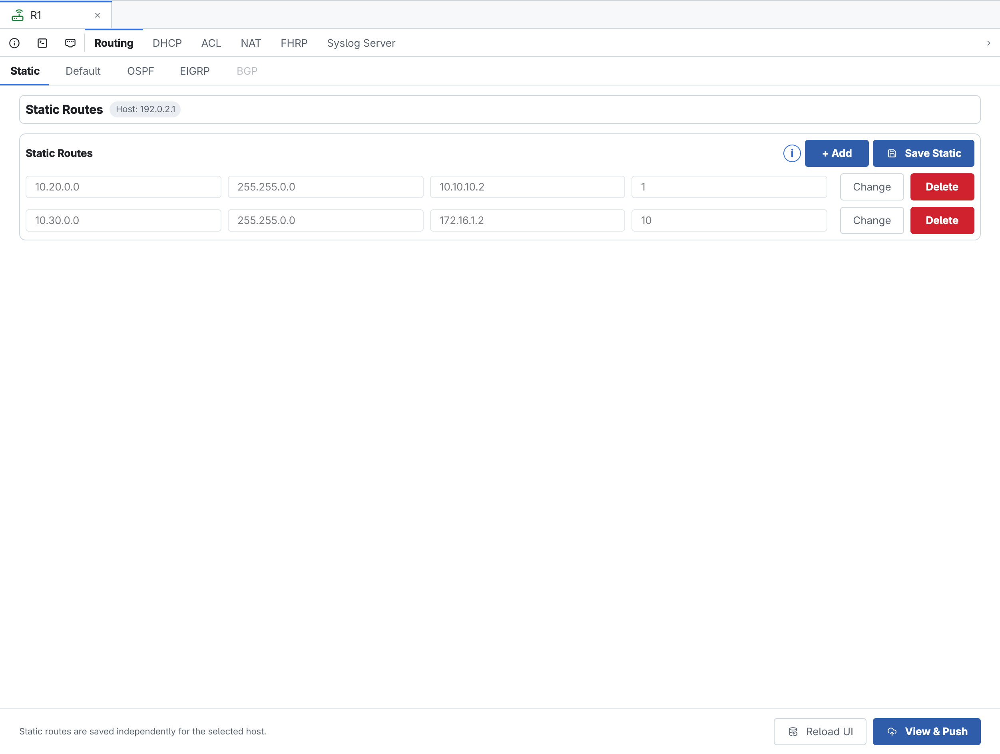{ loading=lazy }
  <figcaption>Hai static route đã lưu cho R1.</figcaption>
</figure>

| Trường | Ý nghĩa |
| --- | --- |
| Network | Địa chỉ mạng đích. |
| Subnet Mask | Mask của prefix đích. |
| Next hop | Router kế tiếp có thể đi tới từ R1. |
| AD | Administrative distance; giá trị thấp hơn được ưu tiên. |

*Static Routes*

Một route AD cao hơn route chính có thể được dùng làm floating static route. Nút **Change** mở chỉnh sửa một dòng đã lưu; **Delete** đánh dấu loại bỏ route khỏi desired state. Các thay đổi chỉ được đưa vào database sau khi Save.

## Default Routes

Tab **Default** quản lý riêng các route `0.0.0.0/0` và cho phép khai báo nhiều next hop. Chọn **+ Add**, nhập gateway rồi chọn **Save Default**.

Next hop phải là địa chỉ IPv4 hợp lệ và có khả năng truy cập đệ quy. Khi dùng nhiều default route, kiểm tra hành vi cân bằng tải hoặc dự phòng trên phiên bản IOS thực tế. Static và Default dùng cùng module preview nhưng được chỉnh ở hai form độc lập.

## OSPF

Tab **OSPF** có hàng thống kê Process, Networks, Host và State. Màn hình Process được minh họa tại [hình minh họa](#fig-ch06-03-ospf-process). State **DIRTY** nghĩa là database đang có cấu hình chờ Push; nó không đồng nghĩa form chưa Save. Hàng nút bên dưới chuyển giữa tám nhóm cấu hình.

### OSPF Process

**Process** quản lý Process ID, Router ID, Reference Bandwidth, Passive Default, Default Originate và AuthenticationCFG.

<figure id="fig-ch06-03-ospf-process" markdown="span">
  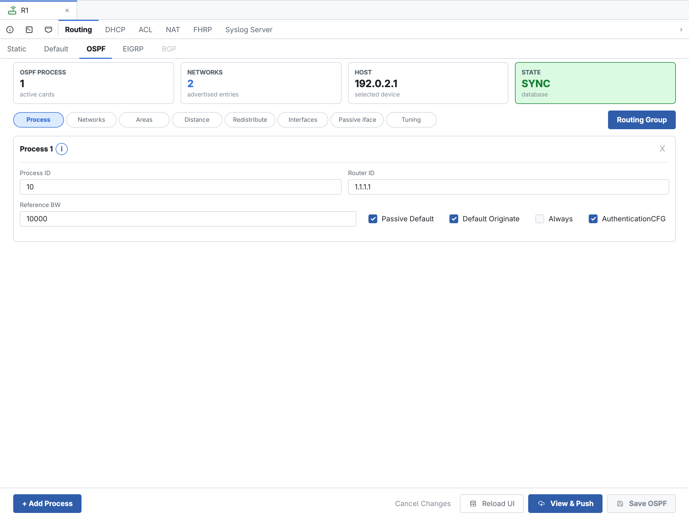{ loading=lazy }
  <figcaption>OSPF process 10 với Router ID 1.1.1.1.</figcaption>
</figure>

- Process ID có phạm vi 1–65535 và chỉ có ý nghĩa cục bộ trên router.
- Router ID phải là IPv4 duy nhất trong miền OSPF.
- Reference BW tính theo Mbps; nên dùng cùng giá trị trong toàn miền.
- Passive Default ngăn hình thành neighbor trên tất cả interface, trừ các interface được cho phép rõ ràng.
- Default Originate quảng bá default route; **Always** cho phép quảng bá ngay cả khi router chưa có default route trong bảng định tuyến.

### OSPF Networks

**Networks** gắn các interface phù hợp với process và area bằng network cùng wildcard mask.

<figure id="fig-ch06-04-ospf-networks" markdown="span">
  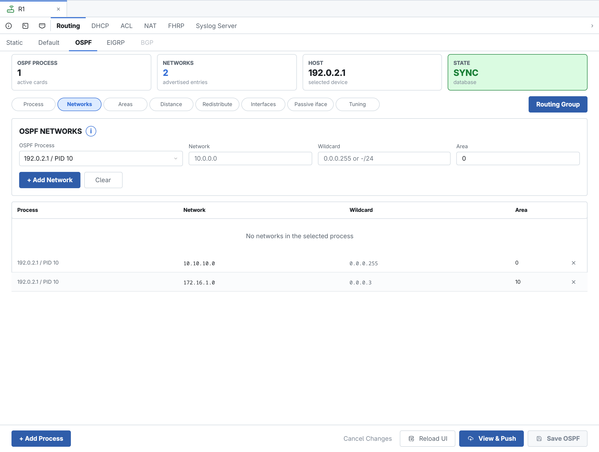{ loading=lazy }
  <figcaption>Các network statement thuộc area 0 và area 10.</figcaption>
</figure>

Chọn process, nhập Network, Wildcard và Area rồi chọn **+ Add Network**. Wildcard là mask đảo, ví dụ mạng `/24` dùng `0.0.0.255`. Một network statement quá rộng có thể kích hoạt OSPF trên interface ngoài dự kiến.

### OSPF Areas

**Areas** tạo area normal, stub hoặc NSSA, cấu hình authentication, no-summary và area range.

<figure id="fig-ch06-05-ospf-areas" markdown="span">
  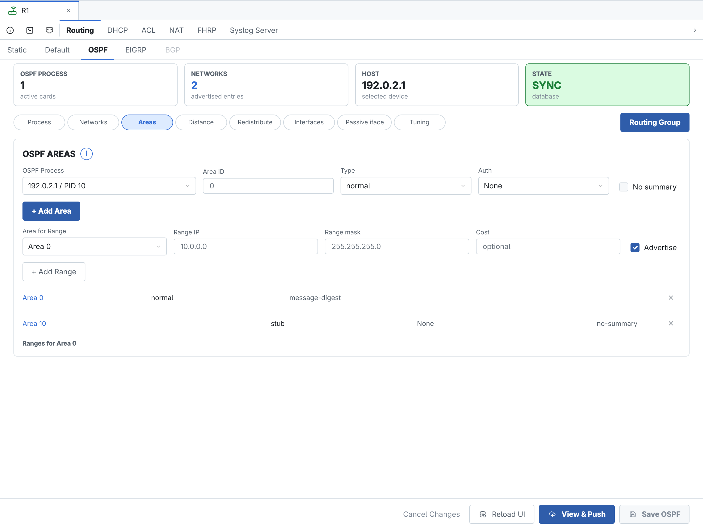{ loading=lazy }
  <figcaption>Area 0 và stub area 10 cùng một summary range.</figcaption>
</figure>

Các router trong cùng area phải dùng loại area tương thích. **No summary** chỉ phù hợp với stub/NSSA. Area range dùng IP và mask để tổng hợp route; Cost là giá trị tùy chọn và **Advertise** quyết định summary có được công bố hay không.

### OSPF Distance

**Distance** đặt administrative distance cho route external, intra-area và inter-area.

Giá trị hợp lệ là 1–255; Cisco IOS thường dùng 110. Chỉ đổi distance khi thiết kế cần điều chỉnh ưu tiên giữa nhiều nguồn route.

### OSPF Redistribute

**Redistribute** nhập route từ static, connected hoặc protocol khác vào OSPF.

<figure id="fig-ch06-07-ospf-redistribute" markdown="span">
  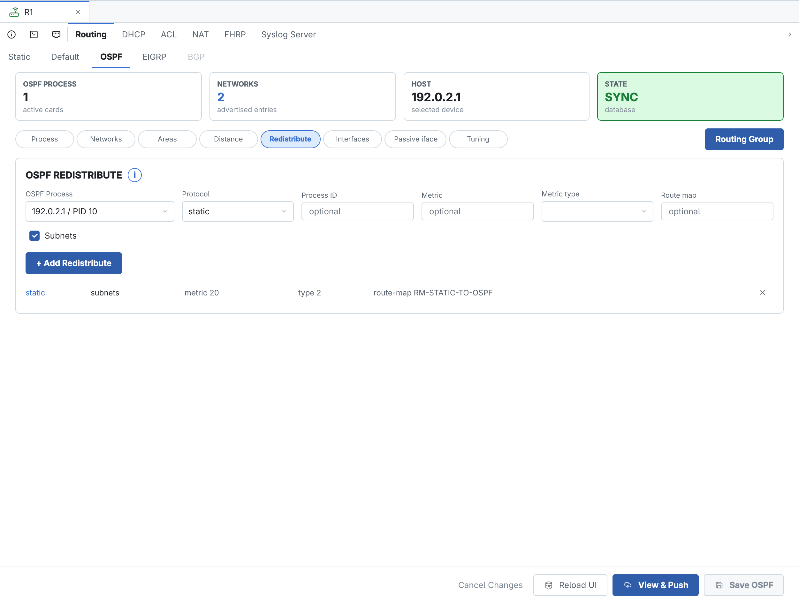{ loading=lazy }
  <figcaption>Redistribute static có route-map và metric mẫu.</figcaption>
</figure>

Route Map giới hạn route được nhập; **Subnets** cho phép đưa cả subnet vào OSPF. Metric Type 1 cộng internal cost dọc đường, còn Type 2 thường giữ external metric và chỉ dùng internal cost để phá hòa. Redistribution có thể tạo loop nên cần policy rõ ràng.

### OSPF Interfaces

**Interfaces** cấu hình hành vi OSPF trên một interface cụ thể.

<figure id="fig-ch06-08-ospf-interfaces" markdown="span">
  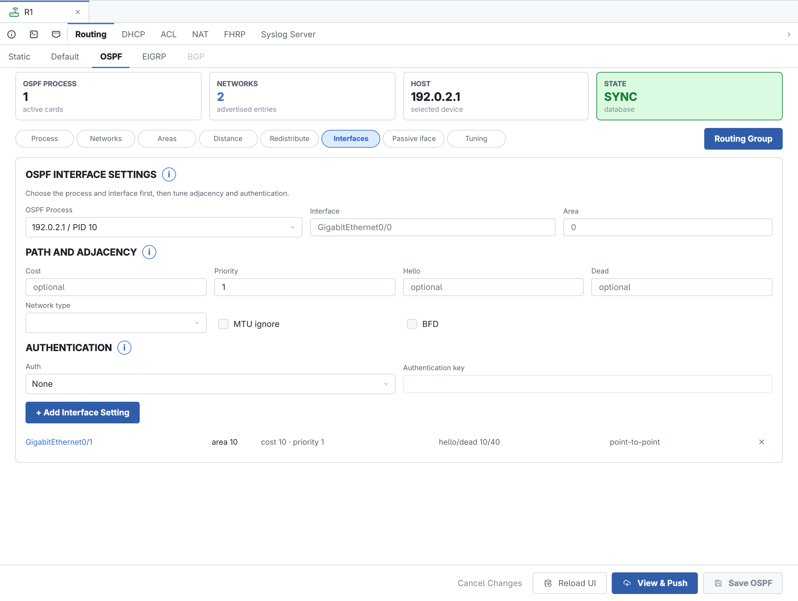{ loading=lazy }
  <figcaption>Cost, timer, network type, BFD và authentication trên interface.</figcaption>
</figure>

Tên interface phải khớp IOS. Cost, priority, hello/dead timer, network type và authentication cần tương thích với neighbor. **MTU Ignore** chỉ nên dùng khi đã đánh giá chênh lệch MTU. Khóa authentication phải được cấu hình đồng nhất ở hai đầu; preview che dữ liệu nhạy cảm khi backend hỗ trợ redaction.

### OSPF Passive Interfaces

**Passive iface** ngăn gửi hello trên interface nhưng vẫn quảng bá connected network. Chế độ non-passive dùng để ghi đè Passive Default.

### OSPF Tuning

**Tuning** gồm Maximum Paths, Max LSA và các timer SPF/LSA throttle.

Timer quá thấp có thể tăng tải CPU khi topology thay đổi liên tục. Chỉ thay đổi sau khi hiểu đơn vị và hành vi của phiên bản IOS đang dùng.

## EIGRP

Tab **EIGRP** cũng có thống kê Process, Networks, Host và State cùng tám nhóm cấu hình riêng.

### EIGRP Process

**Process** quản lý AS Number, Router ID, Auto Summary, Passive Default, BFD, Stub, metric weights, active timer, distance, variance và maximum paths.

<figure id="fig-ch06-11-eigrp-process" markdown="span">
  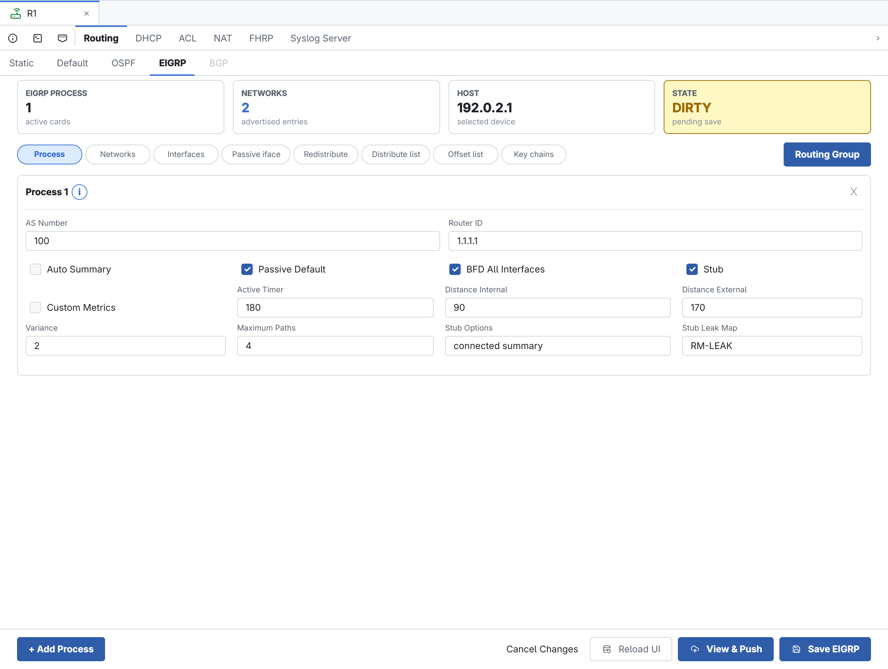{ loading=lazy }
  <figcaption>EIGRP AS 100 với các tham số process mẫu.</figcaption>
</figure>

Neighbor EIGRP phải dùng cùng AS Number. Auto Summary thường được tắt trong mạng không phân lớp. Variance hỗ trợ unequal-cost load balancing; Stub giới hạn query và loại route được quảng bá. Không đổi metric weights nếu các router trong miền không dùng cùng công thức.

### EIGRP Networks

**Networks** kích hoạt EIGRP theo network và wildcard; trường Interface là liên kết tường minh do CAMS lưu cùng cấu hình.

### EIGRP Interfaces

**Interfaces** quản lý bandwidth, delay, hello/hold timer, authentication key chain, summary, split horizon, bandwidth percent, next-hop-self và BFD.

<figure id="fig-ch06-13-eigrp-interfaces" markdown="span">
  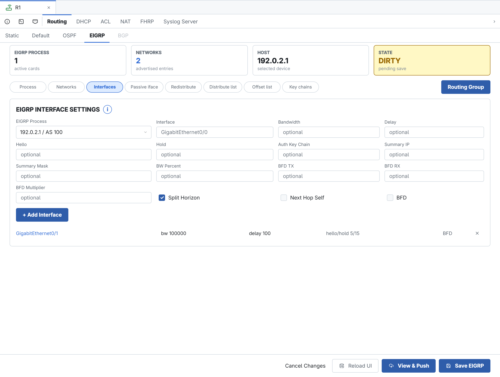{ loading=lazy }
  <figcaption>Các tham số EIGRP của GigabitEthernet0/1.</figcaption>
</figure>

Bandwidth và Delay tác động metric EIGRP, không trực tiếp giới hạn lưu lượng. Split Horizon thường ngăn quảng bá route trở lại interface đã học. Timer và authentication cần khớp với neighbor.

### EIGRP Passive Interfaces

**Passive iface** tắt hello và neighbor trên interface nhưng vẫn quảng bá connected network. **No passive** ghi đè Passive Default.

### EIGRP Redistribute

**Redistribute** nhập route từ protocol khác. EIGRP có thể cần đủ năm thành phần seed metric: bandwidth, delay, reliability, load và MTU.

<figure id="fig-ch06-15-eigrp-redistribute" markdown="span">
  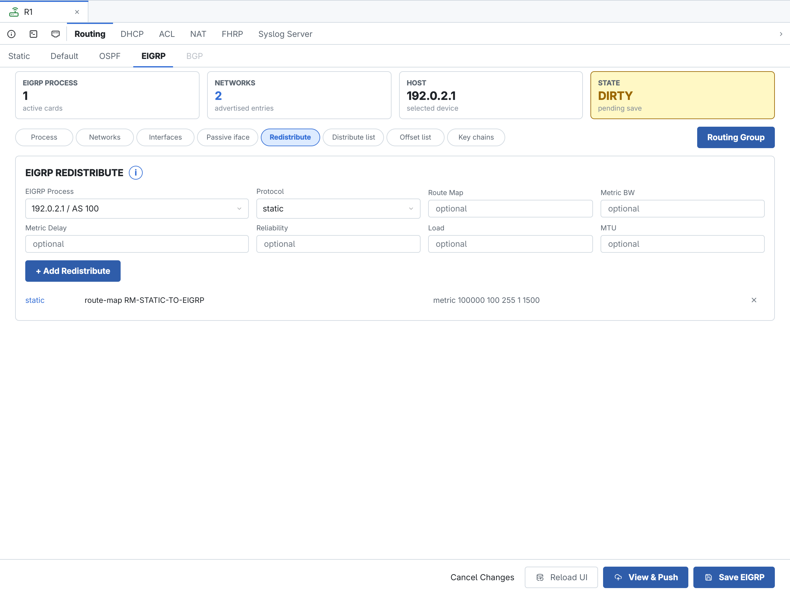{ loading=lazy }
  <figcaption>Redistribute static vào EIGRP với route-map và seed metric.</figcaption>
</figure>

### EIGRP Distribute Lists

**Distribute list** dùng ACL hoặc prefix-list để lọc route nhận vào hoặc quảng bá ra. Interface là tùy chọn; bỏ trống để áp dụng ở cấp process.

### EIGRP Offset Lists

**Offset list** cộng một giá trị vào metric của route khớp ACL theo chiều in hoặc out.

Offset chỉ làm route kém ưu tiên hơn; cần tránh tạo kết quả chọn đường khó dự đoán khi có nhiều policy metric.

### EIGRP Key Chains

**Key chains** lưu chain name, key ID, key string cùng accept/send lifetime để dùng cho authentication trên interface.

<figure id="fig-ch06-18-eigrp-key-chains" markdown="span">
  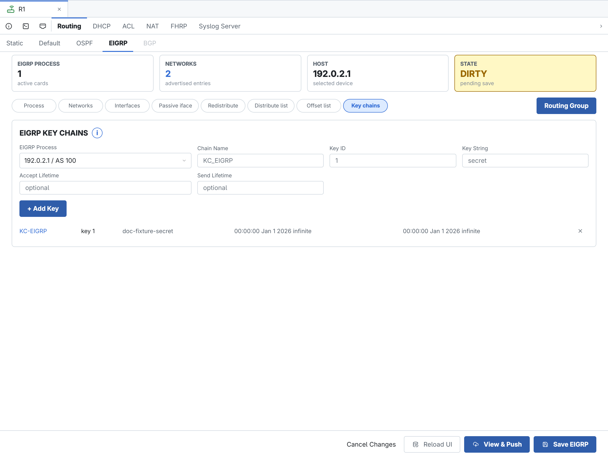{ loading=lazy }
  <figcaption>Key chain KC-EIGRP và khoảng thời gian hiệu lực mẫu.</figcaption>
</figure>

Key string là thông tin nhạy cảm. Không dùng secret thật trong ảnh, tài liệu hay repository; cấu hình thời gian hiệu lực phải tính đến đồng bộ đồng hồ giữa các router.

## Routing Group

Nút **Routing Group** mở workflow bốn bước để tạo cấu hình OSPF đồng bộ trên từ 2 đến 5 router đang ở trạng thái Connected. Quy trình này vẫn giữ các giá trị định danh riêng cho từng router và chỉ dùng chung các tham số thực sự thuộc về toàn nhóm.

### Bước 1 — Hosts

Chọn các router tham gia nhóm. Chỉ những router được đánh dấu mới được lưu và đưa vào cửa sổ View & Push nhiều thiết bị.

<figure id="fig-ch06-19-routing-group-hosts" markdown="span">
  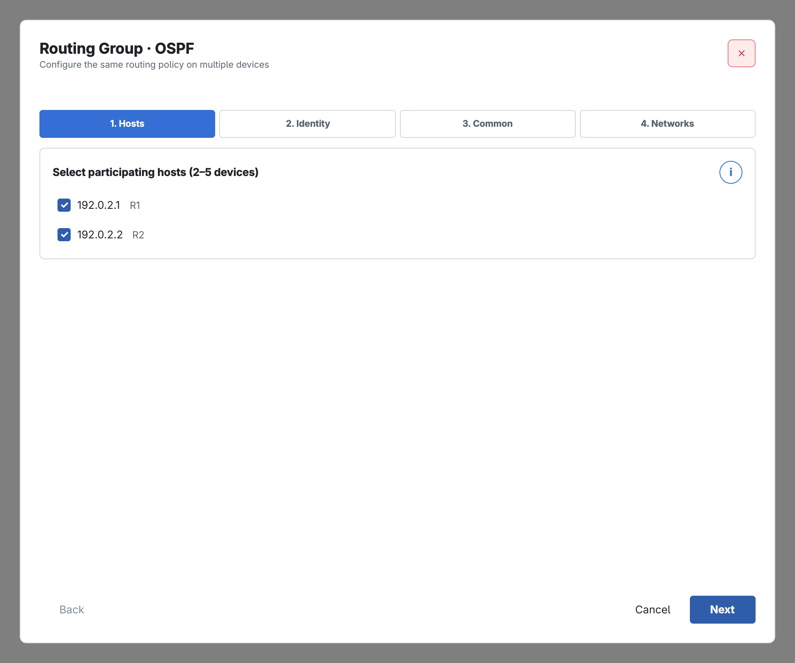{ loading=lazy }
  <figcaption>Chọn hai router R1 và R2 cho Routing Group OSPF.</figcaption>
</figure>

### Bước 2 — Identity

Nhập **Process ID** và **Router ID** riêng cho từng host. Process ID có thể khác nhau giữa các router, còn Router ID phải duy nhất trong miền OSPF.

<figure id="fig-ch06-20-routing-group-identity" markdown="span">
  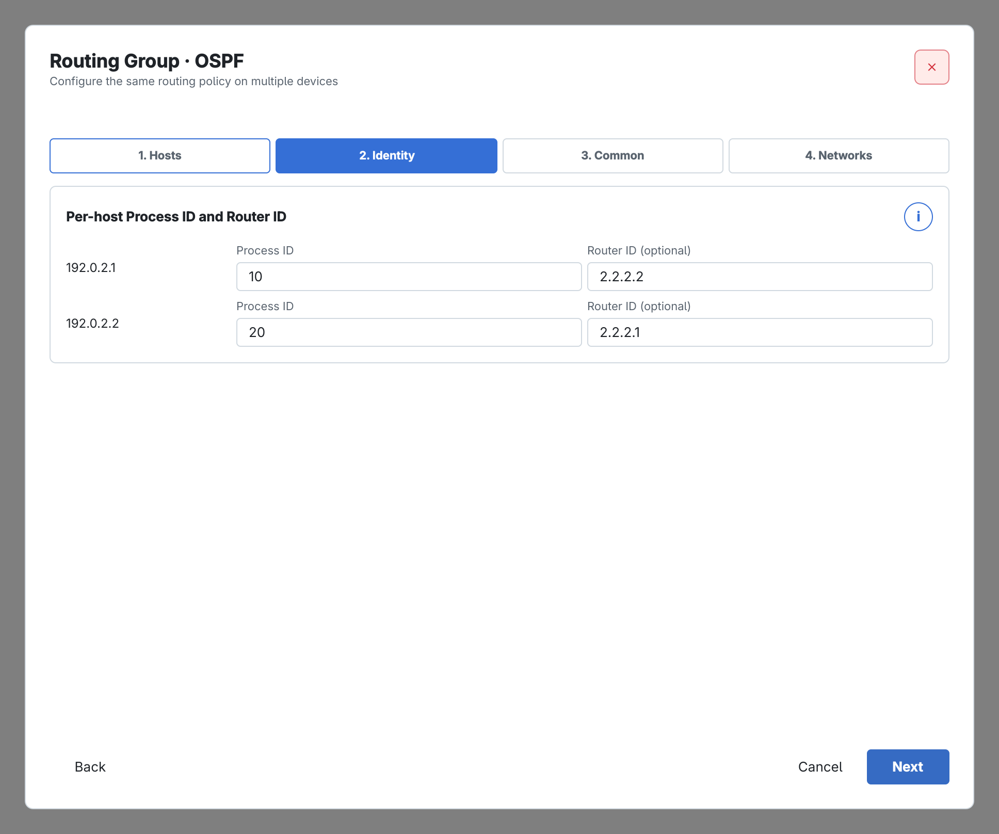{ loading=lazy }
  <figcaption>Process ID và Router ID riêng của từng router.</figcaption>
</figure>

### Bước 3 — Common

Khai báo tham số dùng chung như Reference Bandwidth và Passive Default. Dùng cùng Reference Bandwidth trên toàn miền để phép tính OSPF cost nhất quán.

### Bước 4 — Networks

CAMS liệt kê các connected network theo từng host và kèm interface đã phát hiện. Chọn network cần chạy OSPF, gán Area rồi dùng **Save** hoặc **Save & Push**.

<figure id="fig-ch06-22-routing-group-networks" markdown="span">
  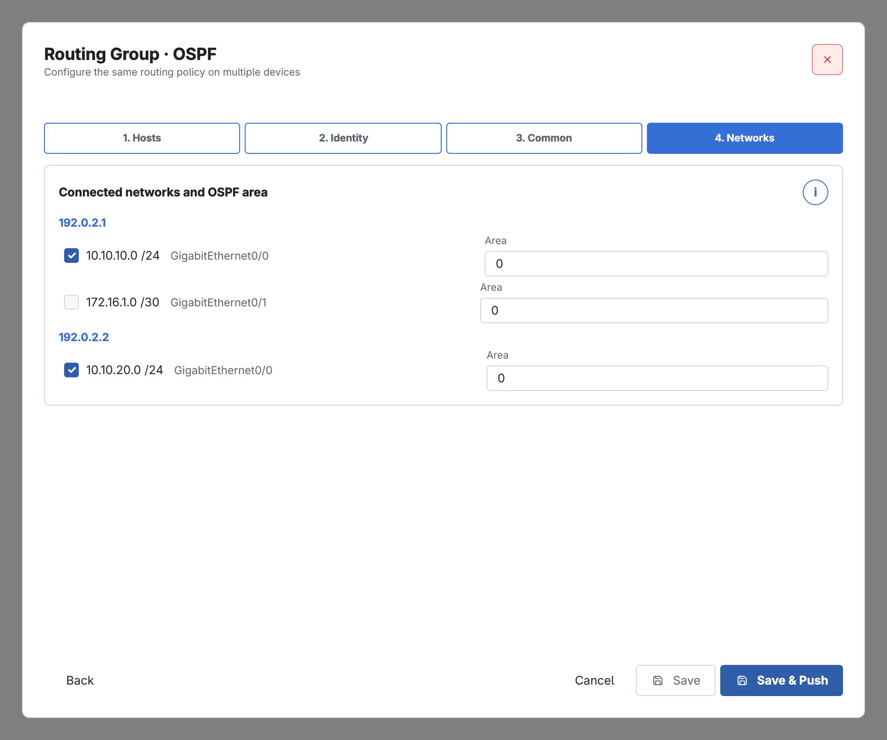{ loading=lazy }
  <figcaption>Chọn network và area độc lập cho R1 và R2.</figcaption>
</figure>

Toàn bộ quy trình gồm:

1. **Hosts**: chọn các router tham gia.
1. **Identity**: nhập Process ID và Router ID riêng từng host.
1. **Common**: nhập tham số OSPF dùng chung.
1. **Networks**: chọn connected network và area của từng host.

<figure id="fig-ch06-26-routing-group-view-push" markdown="span">
  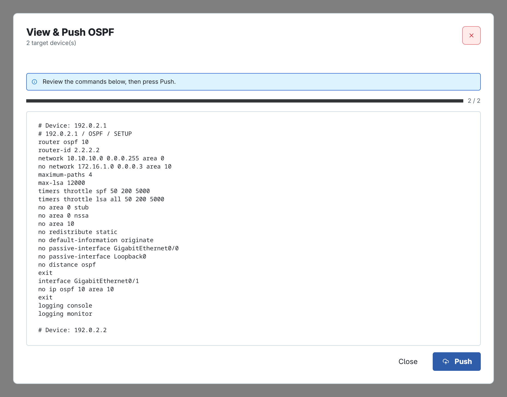{ loading=lazy }
  <figcaption>View & Push OSPF tổng hợp lệnh riêng cho hai thiết bị.</figcaption>
</figure>

Backend kiểm tra network thuộc đúng host trước khi lưu. Kết quả được ghi riêng từng thiết bị; một host lỗi không làm dữ liệu của host khác bị nhập nhầm. Đọc kết quả partial trước khi tiếp tục Push. Trong preview nhiều thiết bị, kiểm tra từng khối `Device` để tránh áp cùng Router ID, sai Process ID hoặc sai network.

## Save, Reload và View & Push

Các nút có vai trò khác nhau:

| Nút | Tác dụng |
| --- | --- |
| Save Static / Default / OSPF / EIGRP | Validate và lưu desired state vào database CAMS. |
| Cancel Changes | Bỏ thay đổi form chưa Save và nạp lại dữ liệu đã lưu. |
| Reload UI | Nạp lại database vào form; không tự lấy cấu hình mới từ router. |
| View & Push | Dựng preview từ các bản ghi pending và cho phép gửi lệnh. |

*Save, Reload và View & Push*

Static và Default dùng chung preview của module STATIC. OSPF và EIGRP có preview riêng để người vận hành đọc đúng process, network, interface, policy và các lệnh xóa đang chờ của từng giao thức.

<figure id="fig-ch06-24-ospf-view-push" markdown="span">
  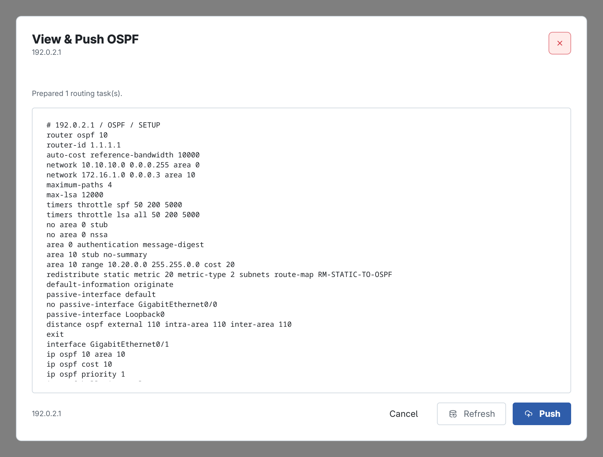{ loading=lazy }
  <figcaption>View & Push OSPF với toàn bộ lệnh của process đang chờ.</figcaption>
</figure>

!!! note "Ghi chú"

    Trong preview, kiểm tra host, module, destination, mask, next hop, AD, process, area/AS và mọi lệnh xóa. **Refresh** dựng lại preview sau khi dữ liệu thay đổi. Chỉ chọn **Push** khi session SSH/Telnet sẵn sàng và đã sao lưu running-config. Sau Push, lấy running-config hoặc routing table mới để xác minh; CAMS chưa cung cấp rollback tự động đầy đủ cho mọi tình huống.

## Bài thực hành tổng hợp

1. Mở R1 → Routing → Static, tạo một route tới mạng lab không gây xung đột.
1. Tạo một default route dự phòng và đặt next hop có thể truy cập.
1. Tạo OSPF process, thêm network, area và passive-interface phù hợp.
1. Mở từng nhóm Distance, Redistribute, Interfaces và Tuning; chỉ nhập tham số khi topology yêu cầu.
1. Tạo EIGRP process trong một bản project lab khác hoặc xóa OSPF trước khi Push nếu không có chủ đích chạy đồng thời hai protocol.
1. Kiểm tra Networks, Interfaces, Passive, Redistribute, Distribute list, Offset list và Key chains của EIGRP.
1. Mở Routing Group để nhận biết bốn bước, nhưng không Save nếu chưa chuẩn bị ít nhất hai router lab.
1. Mở View & Push cho từng module, đọc lệnh và đóng preview. Chỉ Push trong môi trường được phép thay đổi.
