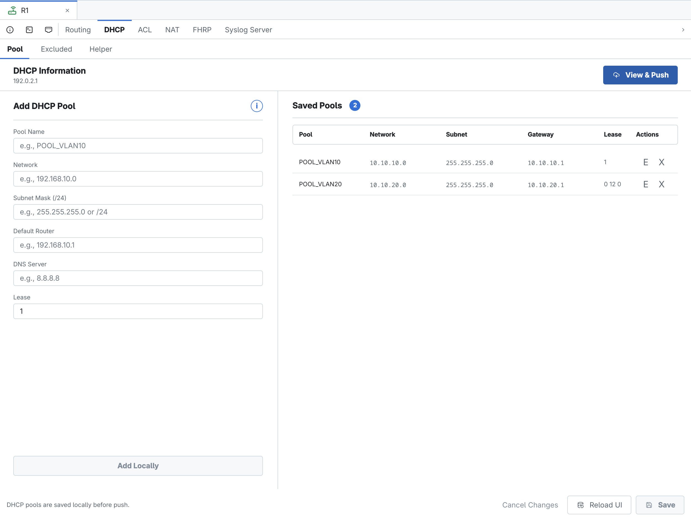
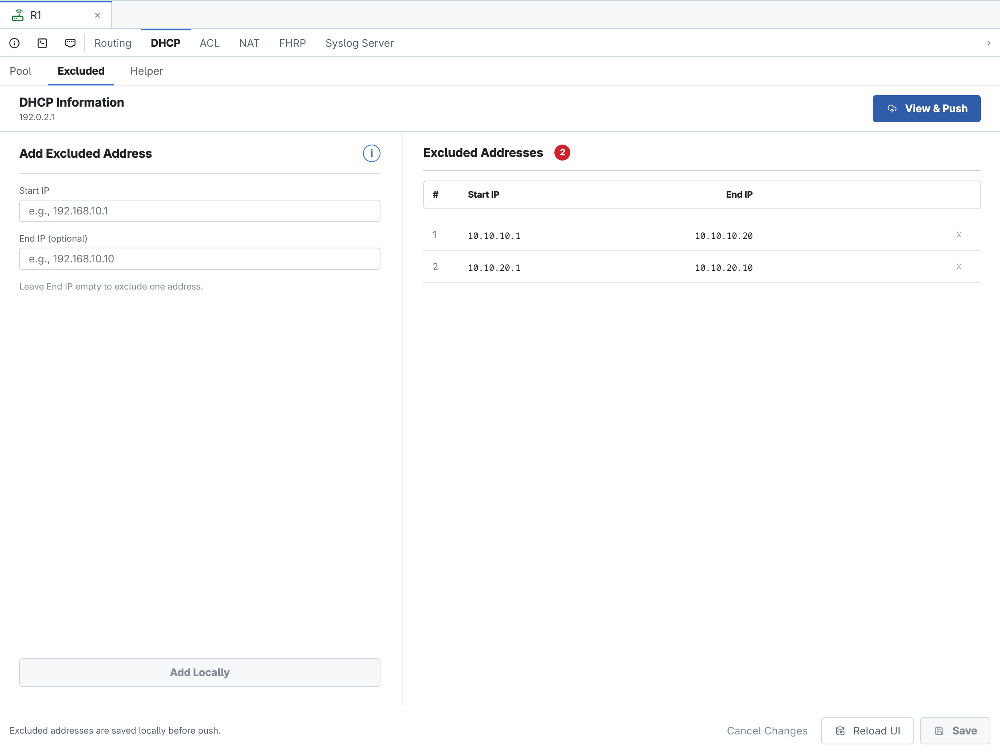
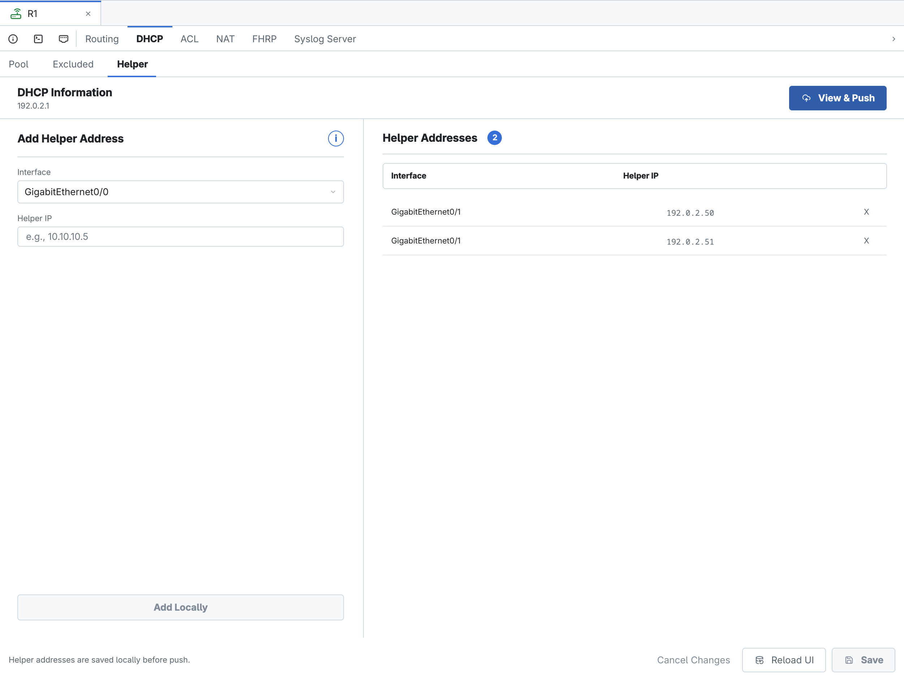
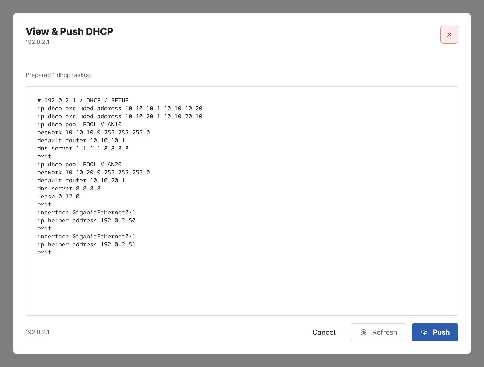

<!-- Đồng bộ tự động từ ../contents/07_cau_hinh_dhcp.typ; chạy scripts/sync_book_markdown.py để cập nhật. -->

# Cấu hình DHCP trên Router

Chương này trình bày ba nhóm cấu hình trong tab **DHCP** của CAMS: Pool, Excluded và Helper. Tất cả dữ liệu được lưu theo router đang active và được kiểm tra trong cửa sổ **View & Push DHCP** riêng trước khi gửi lên thiết bị.

Các địa chỉ trong hình là dữ liệu lab. Khi triển khai thật, cần kiểm tra subnet, gateway, phạm vi cấp phát và khả năng truy cập DHCP server trước khi Push.

## Mở tab DHCP

Chọn router trong Devices Sidebar rồi chọn **DHCP** trên Feature Bar. Thanh tab con gồm **Pool**, **Excluded** và **Helper**. Nút **View & Push** ở góc phải chỉ dựng các lệnh DHCP đang chờ của host hiện tại; nó không trộn với ACL hay Routing.

## DHCP Pool

Tab **Pool** tạo và quản lý các dải cấp phát DHCP cục bộ trên router.

<figure id="fig-ch07-01-dhcp-pools" markdown="span">
  { loading=lazy }
  <figcaption>Hai DHCP pool đã lưu cho các mạng VLAN 10 và VLAN 20.</figcaption>
</figure>

| Trường | Ý nghĩa |
| --- | --- |
| Pool Name | Tên định danh của pool trên Cisco IOS; nên ngắn gọn và không chứa khoảng trắng. |
| Network | Địa chỉ mạng được cấp phát. |
| Subnet Mask | Subnet mask dạng đầy đủ hoặc prefix hợp lệ. |
| Default Router | Gateway được gửi cho DHCP client. |
| DNS Server | Một hoặc nhiều DNS server, phân tách bằng khoảng trắng. |
| Lease | Thời gian thuê; có thể nhập ngày hoặc bộ ngày–giờ–phút theo định dạng CAMS hỗ trợ. |

*DHCP Pool*

Nhập các trường bắt buộc rồi chọn **Add Locally** để đưa pool vào danh sách tạm. Có thể chuẩn bị nhiều pool trước khi chọn **Save**. Nút **Edit** nạp lại một dòng vào form; **Delete** đánh dấu loại bỏ nhưng chưa gửi lệnh lên router.

Network phải là địa chỉ mạng đúng với subnet mask. Default Router nên thuộc cùng subnet và không nằm trong vùng được cấp phát cho client.

## Excluded Addresses

Tab **Excluded** khai báo một địa chỉ hoặc một khoảng địa chỉ router không được phép cấp cho DHCP client. Thường loại trừ gateway, server, access point và các thiết bị dùng địa chỉ tĩnh.

<figure id="fig-ch07-02-dhcp-excluded-addresses" markdown="span">
  { loading=lazy }
  <figcaption>Hai khoảng địa chỉ bị loại trừ khỏi quá trình cấp phát.</figcaption>
</figure>

**Start IP** là địa chỉ đầu. **End IP** là địa chỉ cuối của một khoảng liên tục; để trống trường này nếu chỉ loại trừ một địa chỉ. End IP không được nhỏ hơn Start IP và hai giá trị phải phù hợp với mạng đang vận hành.

## DHCP Helper

Tab **Helper** cấu hình DHCP relay trên interface Layer 3 nhận broadcast từ client. Mỗi bản ghi ghép một interface với địa chỉ unicast của DHCP server.

<figure id="fig-ch07-03-dhcp-helper-addresses" markdown="span">
  { loading=lazy }
  <figcaption>Hai DHCP server dự phòng được gắn với interface relay.</figcaption>
</figure>

Interface phải có địa chỉ IP và hướng về mạng client. Có thể thêm nhiều Helper IP trên cùng interface để dự phòng. Trước khi lưu, kiểm tra router có route tới server và chính sách ACL không chặn DHCP relay.

## Save, Reload và View & Push DHCP

!!! note "Ghi chú"

    Các thay đổi trong từng tab cần được **Save** vào database CAMS trước. **Reload UI** nạp lại dữ liệu đã lưu; **Cancel Changes** bỏ phần chỉnh sửa cục bộ chưa Save.

<figure id="fig-ch07-04-dhcp-view-push" markdown="span">
  { loading=lazy }
  <figcaption>View & Push DHCP tổng hợp Pool, Excluded và Helper đang chờ.</figcaption>
</figure>

Trong preview, kiểm tra riêng các nhóm lệnh:

- `ip dhcp excluded-address` cho địa chỉ bị loại trừ;
- `ip dhcp pool`, network, default-router, DNS và lease cho từng pool;
- `ip helper-address` dưới đúng interface relay.

Chỉ chọn **Push** khi tiêu đề là **View & Push DHCP**, host chính xác và toàn bộ lệnh phù hợp. Sau khi Push, kiểm tra running-config, binding DHCP và thử nhận địa chỉ từ một client lab.
