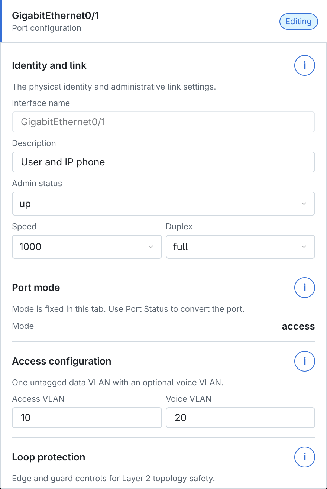
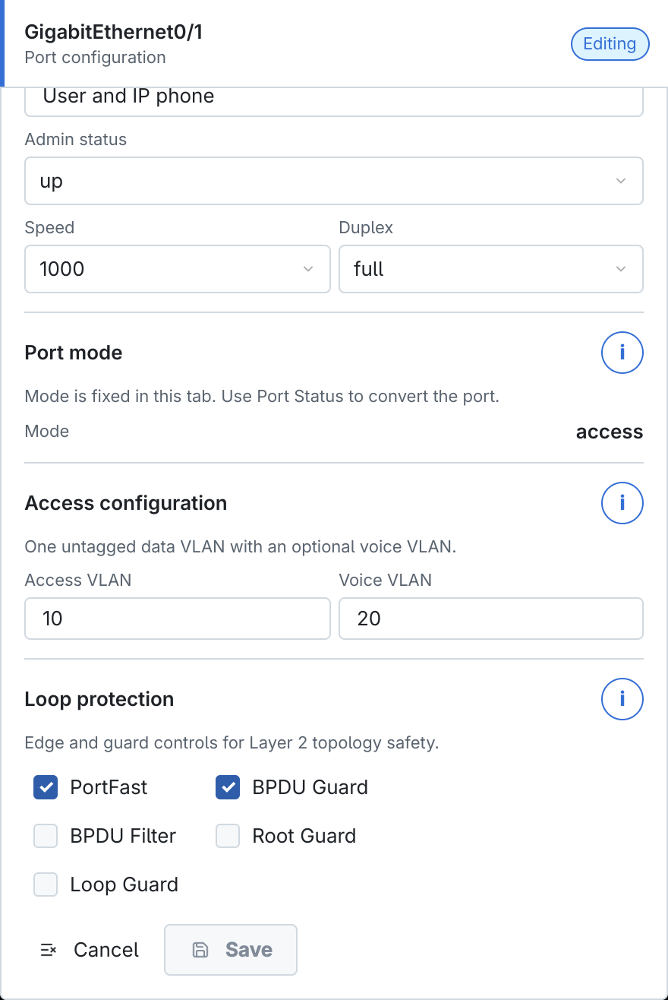
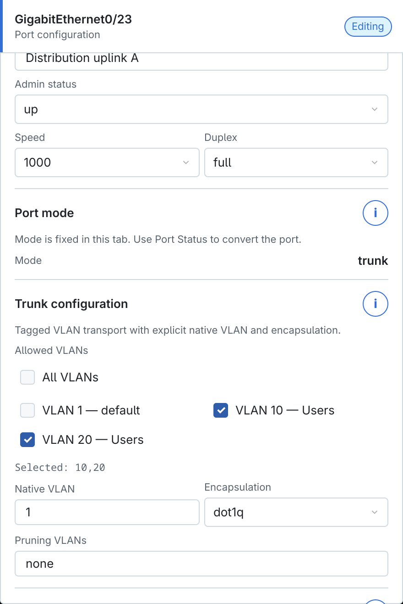
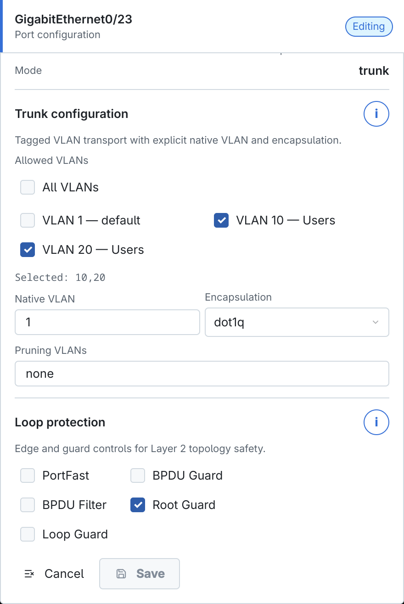
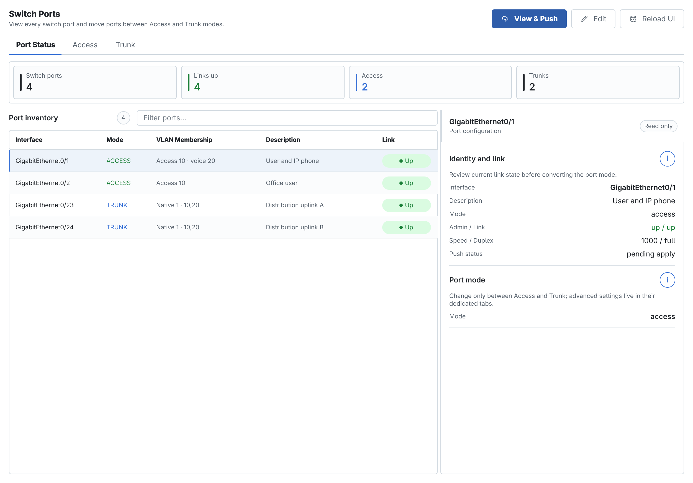
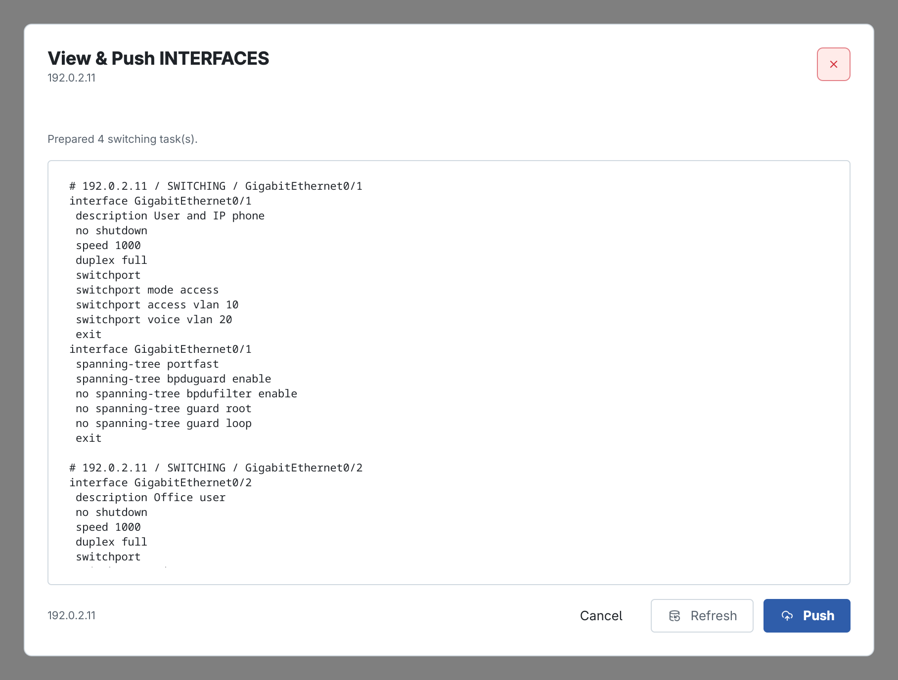

<!-- Đồng bộ tự động từ ../contents/14_interface_switch_l2.typ; chạy scripts/sync_book_markdown.py để cập nhật. -->

# Cấu hình Interface trên Switch Layer 2

Thiết bị có role **SW2** trong CAMS chỉ cung cấp switchport Layer 2. Phần Interfaces gồm ba tab **Port Status**, **Access** và **Trunk**; không có Routed Port hoặc SVI như role SW3.

Chọn switch trong danh sách thiết bị, mở **Interface**, sau đó đồng bộ dữ liệu trước khi sửa. Quy trình an toàn là: chọn đúng port → Edit → nhập tham số → Save → mở **View & Push INTERFACES** → đọc lệnh → Push → đồng bộ và kiểm tra lại.

## Cấu hình Access Port

Mở tab **Access**, chọn port rồi nhấn **Edit**. Access port mang một VLAN dữ liệu không gắn thẻ và có thể có thêm Voice VLAN cho điện thoại IP.

<figure id="fig-ch14-02-access-port-form" markdown="span">
  { loading=lazy }
  <figcaption>Form Access Port với VLAN dữ liệu và Voice VLAN.</figcaption>
</figure>

| Trường | Cách nhập |
| --- | --- |
| **Interface name** | Tên port vật lý đang chọn; trường này chỉ đọc khi chỉnh sửa. |
| **Description** | Mô tả đầu nối, người dùng hoặc thiết bị, ví dụ `User and IP phone`. |
| **Admin status** | `up` sinh `no shutdown`; `down` dùng để đóng port có chủ đích. |
| **Speed** | `auto` để tự thương lượng hoặc chọn tốc độ được cả hai đầu hỗ trợ. Không ép tốc độ khác khả năng của thiết bị đầu cuối. |
| **Duplex** | Thường dùng `auto` hoặc `full`. Hai đầu phải tương thích để tránh lỗi và collision. |
| **Mode** | Chọn `access`. Trên SW2 chỉ có Access và Trunk. |
| **Access VLAN** | VLAN dữ liệu không gắn thẻ, ví dụ `10`. VLAN phải được tạo trước trong tab VLAN. |
| **Voice VLAN** | VLAN thoại tùy chọn, ví dụ `20`; không nhập nếu port không nối IP phone. Voice VLAN không được trùng Access VLAN. |

*Cấu hình Access Port*

### Loop protection cho Access Port

Cuộn xuống phần **Loop protection** để đặt cơ chế bảo vệ STP theo port.

<figure id="fig-ch14-03-access-loop-protection" markdown="span">
  { loading=lazy }
  <figcaption>PortFast và BPDU Guard trên port nối thiết bị đầu cuối.</figcaption>
</figure>

- **PortFast** bỏ qua thời gian hội tụ STP ban đầu. Chỉ bật trên port nối máy trạm, server hoặc điện thoại; không bật trên liên kết giữa hai switch.
- **BPDU Guard** đưa port edge vào trạng thái bảo vệ khi nhận BPDU. Thường bật cùng PortFast để ngăn người dùng cắm switch ngoài ý muốn.
- **BPDU Filter** ngăn gửi/nhận BPDU và có thể che giấu loop; chỉ dùng khi thiết kế đã được kiểm chứng.
- **Root Guard** ngăn port nhận superior BPDU và trở thành đường tới root bridge không mong muốn.
- **Loop Guard** bảo vệ liên kết dự phòng khi BPDU đột ngột biến mất. Không bật đồng thời tùy tiện với các cơ chế edge-port.

!!! note "Ghi chú"

    Chọn **Save** để ghi desired state. Save chưa gửi lệnh lên switch.

## Cấu hình Trunk Port

Mở tab **Trunk**, chọn đường uplink rồi nhấn **Edit**. Trunk vận chuyển nhiều VLAN giữa switch, router-on-a-stick, firewall hoặc hypervisor.

<figure id="fig-ch14-04-trunk-port-form" markdown="span">
  { loading=lazy }
  <figcaption>Form Trunk với danh sách VLAN được phép đi qua liên kết.</figcaption>
</figure>

| Trường | Cách nhập |
| --- | --- |
| **Mode** | Chọn `trunk`. Port Security không áp dụng cho port trunk trong workflow này. |
| **Allowed VLANs** | Chọn các VLAN thực sự cần đi qua. **All VLANs** cho phép toàn bộ VLAN; danh sách cụ thể như `10,20` giảm phạm vi broadcast và sai cấu hình. |
| **Native VLAN** | VLAN gửi frame không gắn thẻ. Giá trị phải giống nhau ở hai đầu trunk; mặc định thường là VLAN 1 nhưng nên theo thiết kế của hệ thống. |
| **Encapsulation** | `dot1q` là lựa chọn phổ biến. Chỉ dùng `isl` nếu nền tảng cũ ở cả hai đầu thật sự hỗ trợ. |
| **Pruning VLANs** | `none` để không pruning hoặc nhập danh sách/range như `10,20-30`. Đây là pruning theo port, khác với tùy chọn VTP Pruning. |

*Cấu hình Trunk Port*

Danh sách checkbox được lấy từ VLAN Database của switch. Nếu không thấy VLAN cần dùng, tạo và Save VLAN trước rồi quay lại form trunk.

### Loop protection cho Trunk

<figure id="fig-ch14-05-trunk-loop-protection" markdown="span">
  { loading=lazy }
  <figcaption>Root Guard trên một uplink cần ngăn superior root.</figcaption>
</figure>

Trunk giữa hai switch thường không bật PortFast hoặc BPDU Guard. Chọn **Root Guard** ở nhánh không được phép trở thành đường về root; chọn **Loop Guard** ở liên kết dự phòng cần bảo vệ trước lỗi mất BPDU. Không dùng cả hai theo thói quen: vai trò topology của port quyết định cơ chế phù hợp.

## Port Status và giao diện tổng thể

Tab **Port Status** cho phép xem đồng thời mode, VLAN membership, description và trạng thái link. Chọn một hàng để đọc thông tin ở inspector bên phải; nút Edit trong tab này chỉ phù hợp khi cần chuyển mode Access/Trunk, còn tham số chi tiết nên sửa trong tab tương ứng.

<figure id="fig-ch14-01-switch-ports-overview" markdown="span">
  { loading=lazy }
  <figcaption>Tổng thể Switch Ports với hai Access Port và hai Trunk Port.</figcaption>
</figure>

Các chỉ số phía trên cho biết tổng switchport, số link up, số Access và số Trunk. Trạng thái **Link Up** chỉ xác nhận liên kết vật lý đang hoạt động; vẫn cần kiểm tra VLAN, STP và lưu lượng thực tế.

## View & Push Interfaces

Sau khi Save các thay đổi, chọn **View & Push** trong trang Switch Ports.

<figure id="fig-ch14-06-interfaces-view-push" markdown="span">
  { loading=lazy }
  <figcaption>Preview riêng của Interfaces trước khi áp dụng lên SW2.</figcaption>
</figure>

Kiểm tra từng khối `interface` và đặc biệt các lệnh sau:

- `switchport mode access/trunk` đúng với vai trò port;
- Access VLAN, Voice VLAN hoặc Allowed/Native VLAN đúng thiết kế;
- `shutdown`/`no shutdown`, speed và duplex không làm mất liên kết quản trị;
- PortFast, BPDU Guard, Root Guard hoặc Loop Guard chỉ xuất hiện trên port dự kiến;
- các lệnh `no` không xóa cấu hình đang cần giữ.

Chỉ nhấn **Push** khi tiêu đề là **View & Push INTERFACES** và host đúng switch. Sau Push, đồng bộ lại dữ liệu, kiểm tra link, VLAN membership và trạng thái STP.
