<!-- Đồng bộ tự động từ ../contents/15_vlan_etherchannel_stp_vtp.typ; chạy scripts/sync_book_markdown.py để cập nhật. -->

# Cấu hình Switching trên SW2

Nhóm **Switching** của SW2 gồm bốn tab **VLAN**, **EtherChannel**, **STP** và **VTP**. Nên thực hiện theo thứ tự: tạo VLAN → cấu hình trunk/access → tạo EtherChannel nếu có → đặt STP root → chỉ cấu hình VTP khi đã kiểm tra VLAN database của mọi switch tham gia.

Mỗi tab có desired state và View & Push riêng. Save ở một tab không tự Push cấu hình của tab khác.

## VLAN Database

Chọn **Switching → VLAN**, chọn một VLAN để Edit hoặc nhấn **Add** để tạo mới.

<figure id="fig-ch15-01-vlan-form" markdown="span">
  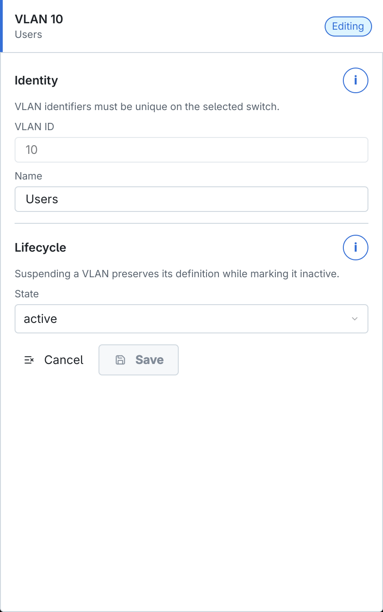{ loading=lazy }
  <figcaption>Form VLAN ID 10 dành cho người dùng.</figcaption>
</figure>

| Trường | Cách nhập |
| --- | --- |
| **VLAN ID** | Số định danh duy nhất từ 1–4094. VLAN 1 là VLAN mặc định và không thể xóa trong CAMS. |
| **Name** | Tên dễ nhận biết như `Users`, `Voice`, `Management`; không dùng tên mơ hồ. |
| **State** | `active` cho phép VLAN hoạt động; `suspend` giữ định nghĩa nhưng đánh dấu VLAN không hoạt động. |

*VLAN Database*

Không xóa VLAN khi vẫn được Access Port, Voice VLAN, trunk, STP hoặc policy bảo mật tham chiếu. Chuyển các phụ thuộc trước rồi mới xóa.

Sau Save, chọn **View & Push VLAN**. Preview chỉ nên chứa VLAN đang chờ áp dụng hoặc xóa.

<figure id="fig-ch15-03-vlan-view-push" markdown="span">
  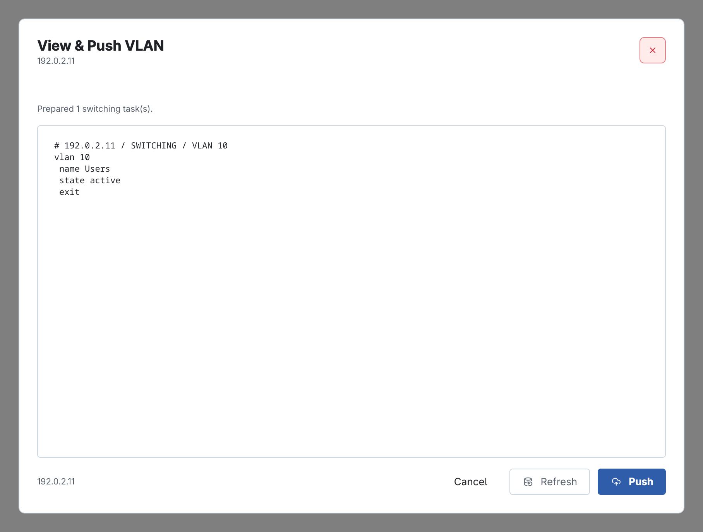{ loading=lazy }
  <figcaption>Preview tạo VLAN 10, đặt tên Users và trạng thái active.</figcaption>
</figure>

## EtherChannel thủ công

EtherChannel gộp nhiều liên kết vật lý thành một Port-channel. Các member phải tương thích về speed, duplex, switchport mode, native VLAN và allowed VLANs.

<figure id="fig-ch15-04-etherchannel-form" markdown="span">
  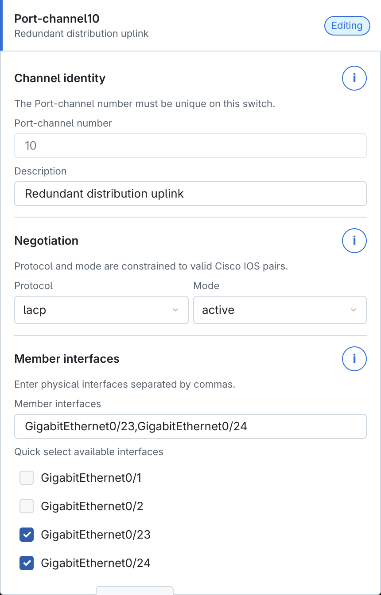{ loading=lazy }
  <figcaption>Port-channel10 dùng LACP active với hai member uplink.</figcaption>
</figure>

| Trường | Ý nghĩa |
| --- | --- |
| **Port-channel number** | Số định danh logic duy nhất trên switch, ví dụ `10`; phải được nền tảng IOS hỗ trợ. |
| **Description** | Mục đích của bundle, ví dụ `Redundant distribution uplink`. |
| **Protocol** | `lacp`, `pagp` hoặc `static`. LACP là chuẩn phổ biến; PAgP dành cho thiết bị Cisco hỗ trợ; Static không thương lượng. |
| **Mode** | LACP: `active/passive`; PAgP: `desirable/auto`; Static: `on`. LACP/PAgP cần ít nhất một đầu chủ động thương lượng. |
| **Member interfaces** | Danh sách port vật lý phân tách bằng dấu phẩy. Một port không được đồng thời thuộc channel khác. |

*EtherChannel thủ công*

Nút **Quick select available interfaces** chỉ liệt kê port phù hợp và chưa thuộc EtherChannel khác. Vẫn phải xác minh dây nối thực tế và cấu hình phía peer.

<figure id="fig-ch15-06-etherchannel-view-push" markdown="span">
  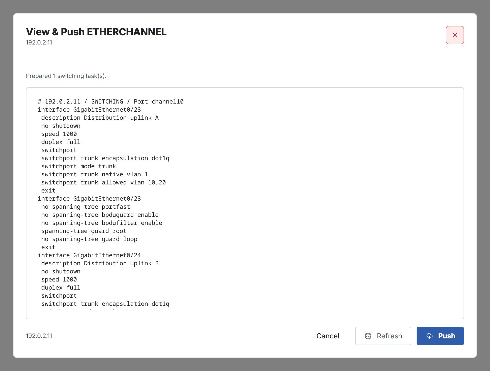{ loading=lazy }
  <figcaption>View & Push EtherChannel gồm Port-channel và từng member interface.</figcaption>
</figure>

Trong preview, kiểm tra cấu hình Port-channel trước, sau đó từng member và lệnh `channel-group`. Protocol/mode ở hai đầu phải tạo được cặp hợp lệ; cấu hình VLAN của Port-channel và member phải đồng nhất.

## Quick EtherChannel giữa hai switch

Nút **Quick Link** tạo một cấu hình khớp nhau trên hai switch đang Connected và mở quy trình ba bước.

### Bước 1 — Local port

<figure id="fig-ch15-05-quick-etherchannel" markdown="span">
  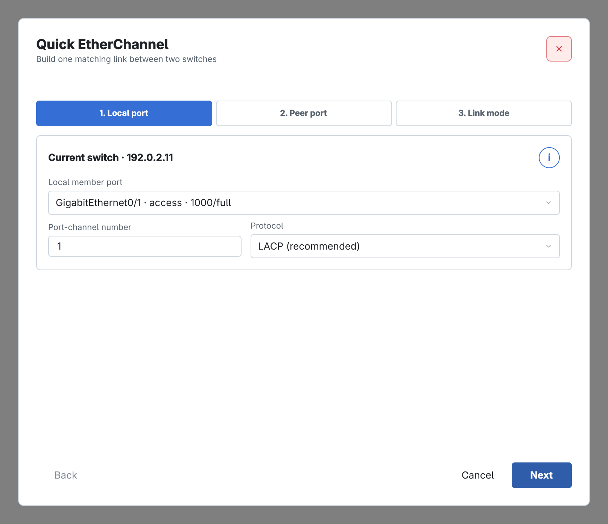{ loading=lazy }
  <figcaption>Chọn member local, số Port-channel và giao thức.</figcaption>
</figure>

- **Local member port**: cổng vật lý trên switch hiện tại.
- **Port-channel number**: cùng một số sẽ được dùng ở hai đầu.
- **Protocol**: nên chọn LACP khi cả hai thiết bị hỗ trợ.

### Bước 2 — Peer port

<figure id="fig-ch15-12-quick-etherchannel-peer" markdown="span">
  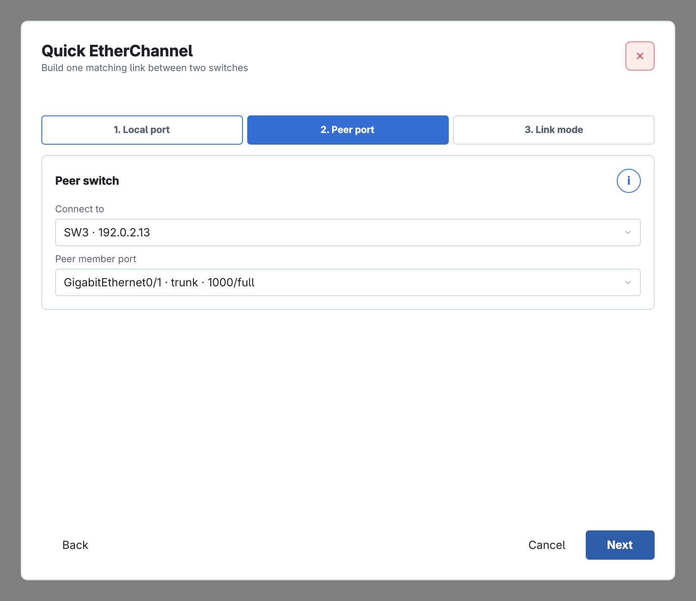{ loading=lazy }
  <figcaption>Chọn switch peer và cổng nối đúng với local port.</figcaption>
</figure>

**Connect to** là switch ở đầu kia; **Peer member port** phải là đầu nối vật lý tương ứng. CAMS không thể xác minh thay người dùng rằng hai cổng đang nối cùng một sợi/cặp liên kết.

### Bước 3 — Link mode

<figure id="fig-ch15-13-quick-etherchannel-link-mode" markdown="span">
  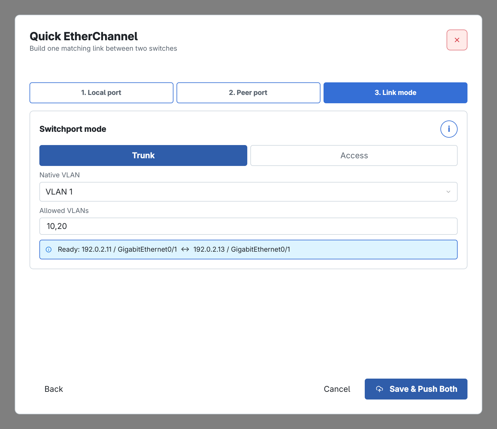{ loading=lazy }
  <figcaption>Đặt cùng Switchport mode và VLAN cho cả hai đầu.</figcaption>
</figure>

- Chọn **Trunk** cho uplink mang nhiều VLAN; nhập Native VLAN và Allowed VLANs.
- Chọn **Access** khi Port-channel chỉ thuộc một VLAN dữ liệu.
- Chỉ các VLAN active có chung trên hai switch mới được chọn.
- Dòng **Ready** phải hiển thị đúng cặp host/interface trước khi chọn **Save & Push Both**.

Quick EtherChannel tạo và preview cấu hình cho cả hai thiết bị. Nếu chỉ muốn lưu desired state mà chưa triển khai, dùng form EtherChannel thủ công thay vì nút Save & Push Both.

## Spanning Tree Protocol

Chọn **STP**, Add hoặc Edit policy theo VLAN.

<figure id="fig-ch15-07-stp-form" markdown="span">
  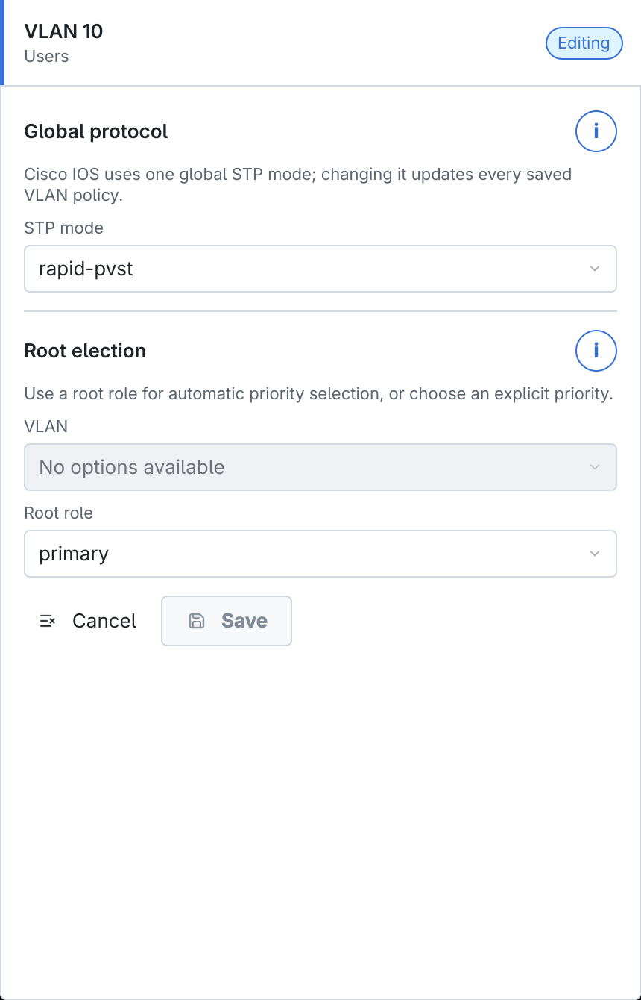{ loading=lazy }
  <figcaption>Rapid-PVST và vai trò Root Primary cho VLAN 10.</figcaption>
</figure>

| Trường | Cách nhập |
| --- | --- |
| **STP mode** | `pvst` hoặc `rapid-pvst`. Đây là chế độ toàn switch; các policy VLAN đã lưu phải dùng cùng mode. Rapid-PVST hội tụ nhanh hơn khi toàn miền L2 hỗ trợ. |
| **VLAN** | Instance VLAN cần điều khiển root election. VLAN phải tồn tại. |
| **Root role** | `primary`, `secondary` hoặc `none`. Primary/Secondary để IOS chọn priority phù hợp. |
| **Bridge priority** | Chỉ dùng khi Root role là `none`; giá trị theo bước 4096, số thấp thắng root election. |

*Spanning Tree Protocol*

Không đặt Primary cho cùng VLAN trên nhiều switch. Một thiết kế phổ biến là distribution switch thứ nhất Primary và switch thứ hai Secondary, có đối chiếu đường đi thực tế của VLAN.

<figure id="fig-ch15-08-stp-view-push" markdown="span">
  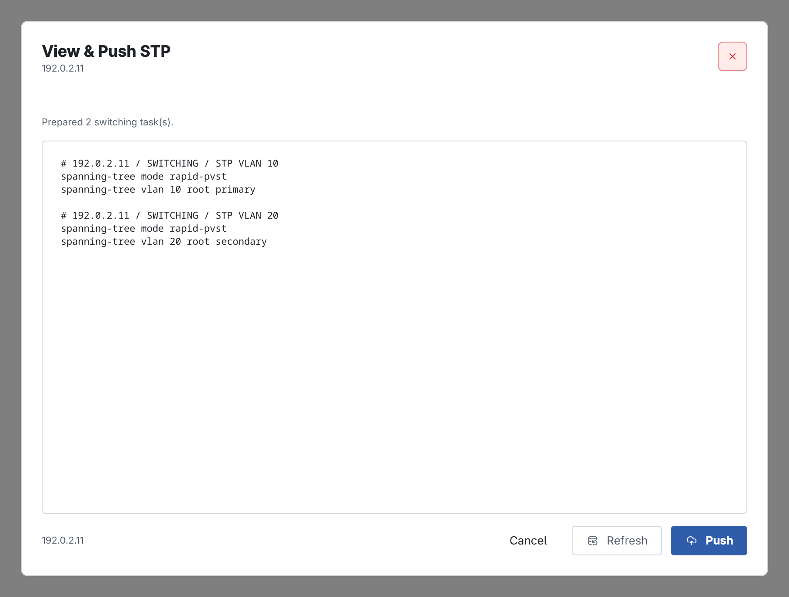{ loading=lazy }
  <figcaption>View & Push STP với policy riêng cho VLAN 10 và VLAN 20.</figcaption>
</figure>

Kiểm tra `spanning-tree mode`, từng VLAN và root role/priority. Sau Push, xem root bridge, root port, blocked/forwarding port và thử failover trong lab.

## VTP Group

!!! note "Ghi chú"

    VTP Group áp dụng một domain cho từ hai đến năm switch đang Connected. VTP có thể thay đổi VLAN database trên nhiều thiết bị, vì vậy chỉ dùng khi đã hiểu trạng thái revision/domain hiện tại và có bản sao lưu.

<figure id="fig-ch15-09-vtp-group-top" markdown="span">
  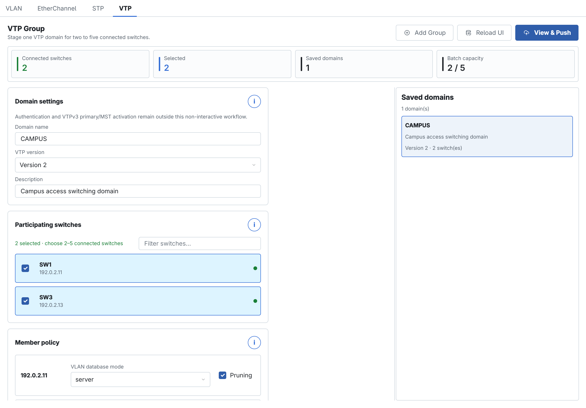{ loading=lazy }
  <figcaption>Domain CAMPUS, phiên bản 2 và hai switch tham gia.</figcaption>
</figure>

| Trường | Ý nghĩa |
| --- | --- |
| **Domain name** | Tên domain dùng chung; có thể phân biệt hoa/thường trên một số nền tảng. Mọi member phải nhập giống nhau. |
| **VTP version** | Version 1, 2 hoặc 3; chọn phiên bản được tất cả switch hỗ trợ. |
| **Description** | Mô tả phạm vi domain. |
| **Participating switches** | Chọn 2–5 switch Connected. Một switch chỉ tham gia một domain trong workflow này. |

*VTP Group*

Authentication và kích hoạt VTPv3 primary/MST nằm ngoài workflow không tương tác này.

<figure id="fig-ch15-10-vtp-member-policy" markdown="span">
  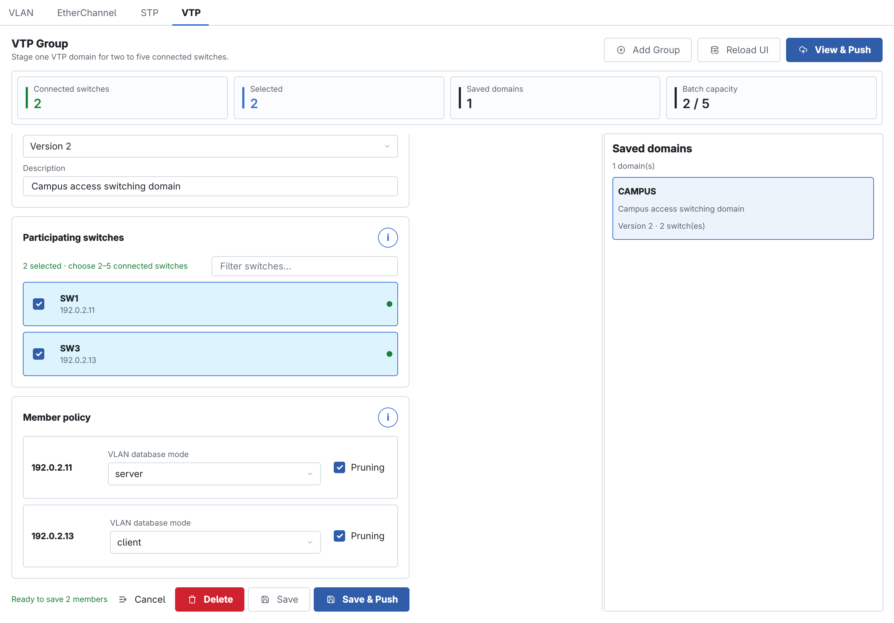{ loading=lazy }
  <figcaption>Member policy với SW1 Server, SW3 Client và Pruning.</figcaption>
</figure>

- **server** có thể cập nhật VLAN database và quảng bá thay đổi.
- **client** học VLAN database từ server và không tạo VLAN cục bộ theo cách thông thường.
- **transparent** chuyển tiếp advertisement nhưng duy trì VLAN cục bộ.
- **off** tắt tham gia khi nền tảng hỗ trợ.
- **Pruning** giảm flooded traffic không cần thiết trên trunk; không thay thế Allowed VLAN list hoặc pruning theo port.

Nên có số lượng server phù hợp với thiết kế, không đặt mọi switch access thành server. Chọn **Save** để chỉ lưu hoặc **Save & Push** nếu muốn mở ngay preview.

<figure id="fig-ch15-11-vtp-view-push" markdown="span">
  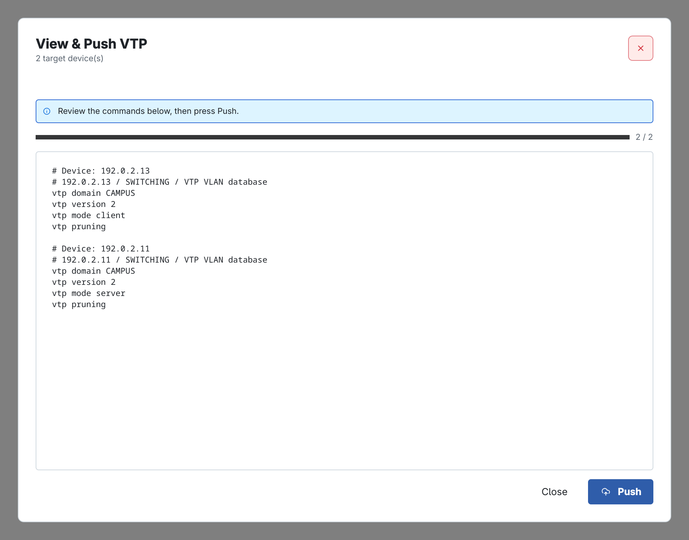{ loading=lazy }
  <figcaption>View & Push VTP tổng hợp preview riêng cho từng member.</figcaption>
</figure>

Đọc từng khối `# Device`, kiểm tra domain, version, mode và pruning của đúng host. Chỉ Push khi cả hai preview thành công. Sau Push, kiểm tra VTP status và VLAN database trên từng switch trước khi tạo hoặc xóa VLAN tiếp theo.
