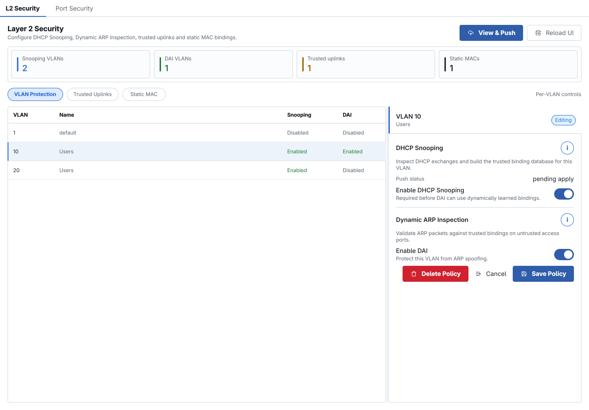
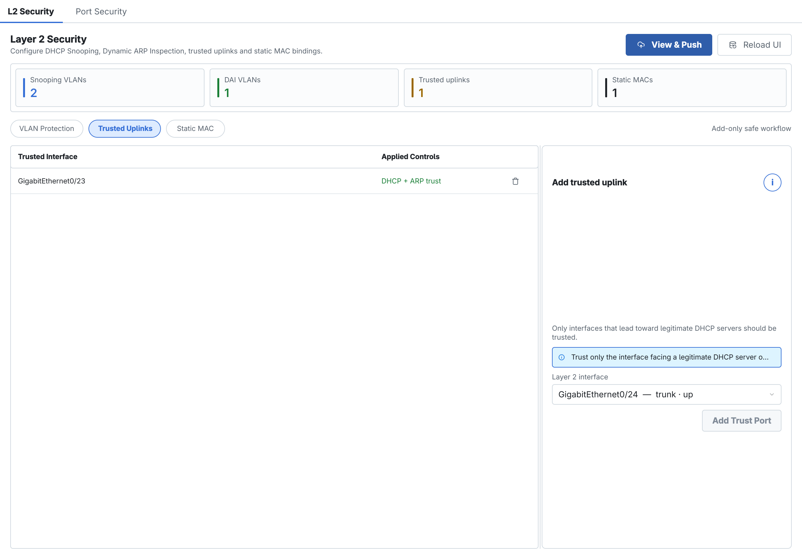
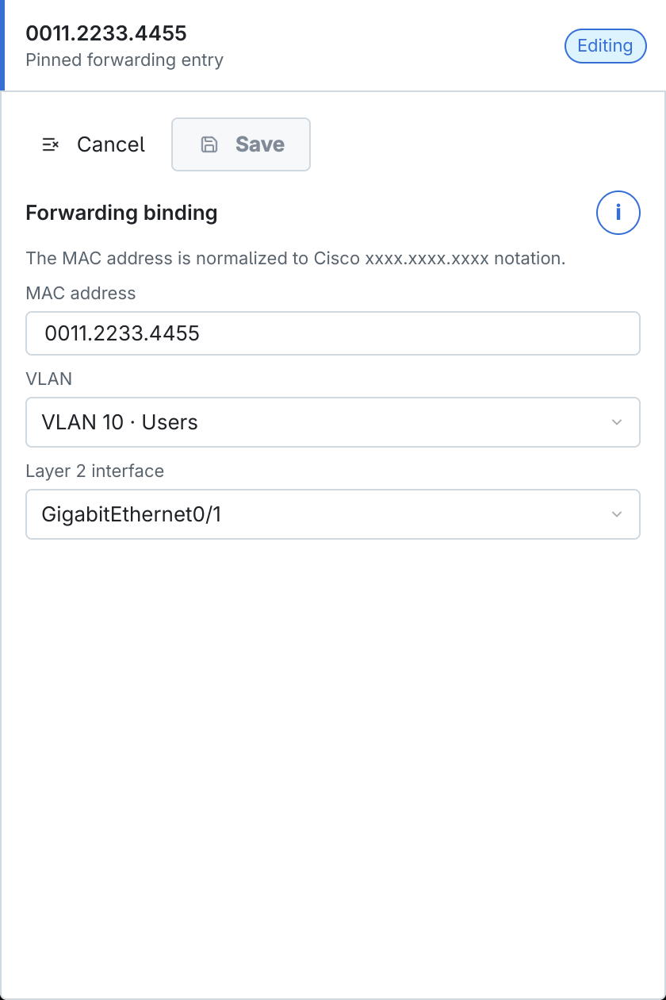
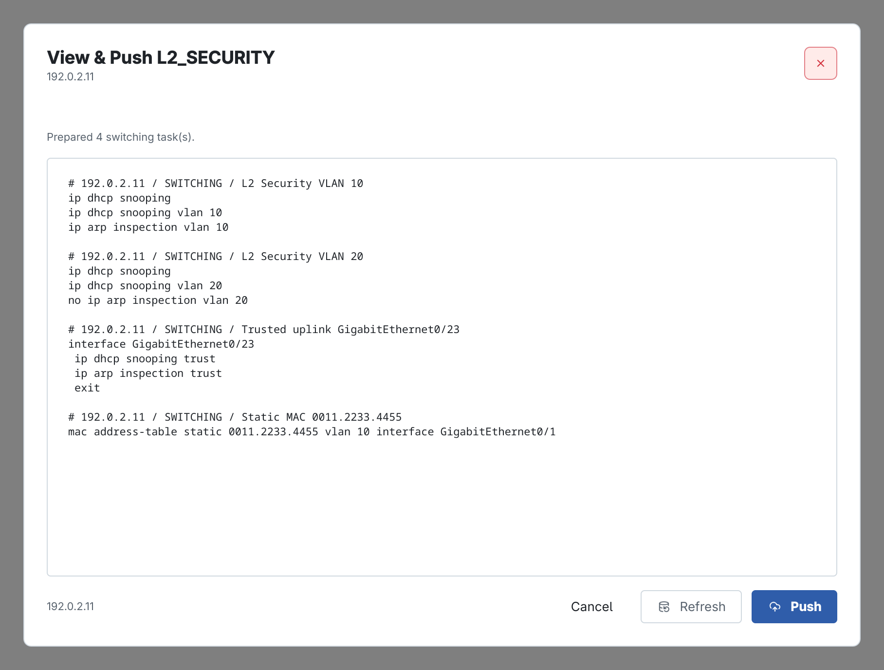
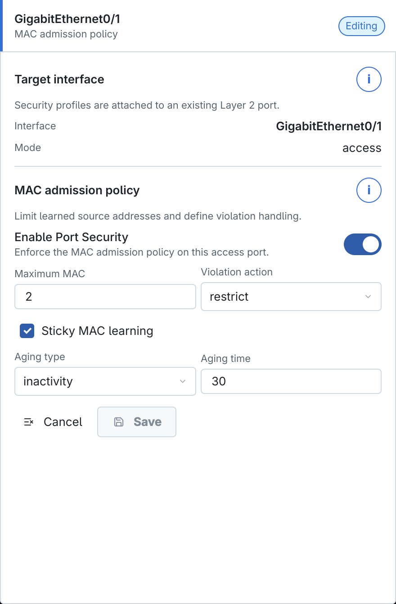
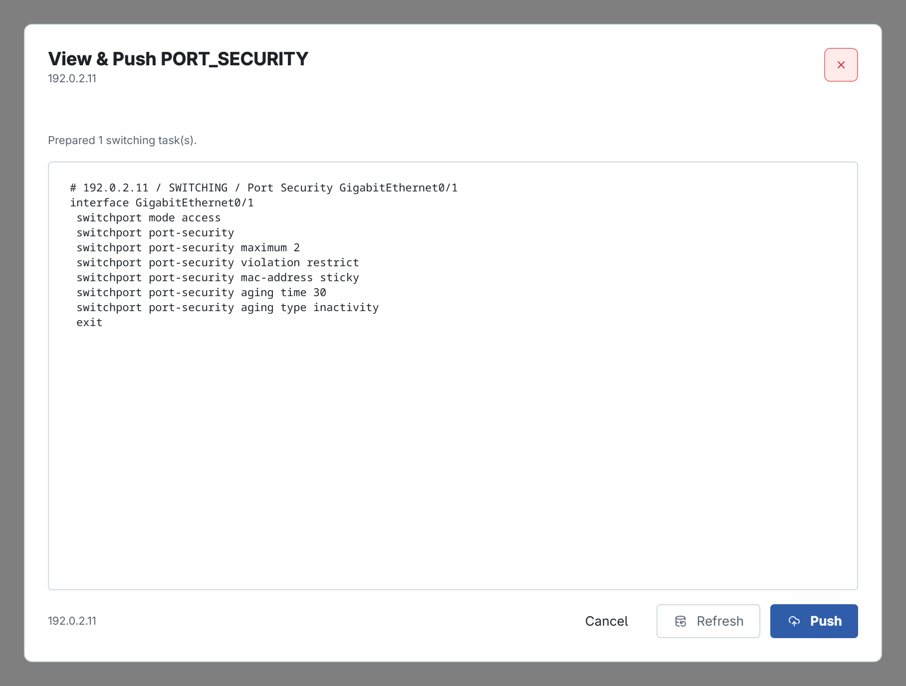

<!-- Đồng bộ tự động từ ../contents/16_bao_mat_switch_l2.typ; chạy scripts/sync_book_markdown.py để cập nhật. -->

# Cấu hình bảo mật trên Switch Layer 2

Nhóm **Security** của SW2 gồm **L2 Security** và **Port Security**. L2 Security bảo vệ DHCP/ARP theo VLAN, xác định uplink tin cậy và tạo Static MAC; Port Security giới hạn địa chỉ MAC được học trên từng access port.

Thứ tự khuyến nghị: hoàn thành VLAN và Interface → xác định uplink thật sự tin cậy → bật DHCP Snooping → bật DAI → thêm Static MAC nếu cần → cấu hình Port Security trên access port → kiểm tra hai cửa sổ View & Push riêng.

## VLAN Protection

Mở **Security → L2 Security → VLAN Protection**, chọn VLAN cần bảo vệ.

<figure id="fig-ch16-01-vlan-protection" markdown="span">
  { loading=lazy }
  <figcaption>DHCP Snooping và Dynamic ARP Inspection theo từng VLAN.</figcaption>
</figure>

- **Enable DHCP Snooping** kiểm tra bản tin DHCP trên VLAN và tạo cơ sở dữ liệu binding IP–MAC–port. Xác định trusted uplink trước khi triển khai để không chặn phản hồi từ DHCP server hợp lệ.
- **Enable DAI** kiểm tra ARP dựa trên DHCP Snooping binding hoặc Static MAC. CAMS tự bật DHCP Snooping khi bật DAI trong workflow này, vì DAI cần nguồn binding cho client học động.
- **Save Policy** lưu hai trạng thái cho VLAN đang chọn. Có thể bật Snooping mà chưa bật DAI để triển khai theo từng giai đoạn.

Không bật đồng loạt trên VLAN production khi chưa xác định đường DHCP server, relay và client dùng IP tĩnh. Với host IP tĩnh không có DHCP binding, chuẩn bị binding phù hợp trước khi DAI có hiệu lực.

## Trusted Uplinks

Chuyển sang **Trusted Uplinks**.

<figure id="fig-ch16-02-trusted-uplinks" markdown="span">
  { loading=lazy }
  <figcaption>Danh sách uplink tin cậy và form chọn Layer 2 interface.</figcaption>
</figure>

| Thành phần | Cách dùng |
| --- | --- |
| **Trusted Interface** | Port hướng tới DHCP server hợp lệ hoặc upstream switch đáng tin cậy. |
| **Applied Controls** | CAMS áp dụng DHCP trust và ARP trust cho port. |
| **Layer 2 interface** | Chọn port access/trunk đã có trong Interfaces; ưu tiên uplink theo sơ đồ mạng. |
| **Add Trust Port** | Lưu port vào desired state. Xóa biểu tượng thùng rác nếu đã chọn nhầm. |

*Trusted Uplinks*

!!! note "Ghi chú"

    Trust cho phép lưu lượng vượt qua kiểm tra Snooping/DAI, vì vậy **không trust port nối người dùng**. Kiểm tra description, dây nối và neighbor trước khi Save.

## Static MAC Binding

Chuyển sang **Static MAC**, chọn **Add** hoặc Edit binding hiện có.

<figure id="fig-ch16-03-static-mac-form" markdown="span">
  { loading=lazy }
  <figcaption>Binding cố định MAC–VLAN–Interface cho một thiết bị.</figcaption>
</figure>

| Trường | Cách nhập |
| --- | --- |
| **MAC address** | Địa chỉ client. CAMS chuẩn hóa về dạng Cisco `xxxx.xxxx.xxxx`; ví dụ `0011.2233.4455`. |
| **VLAN** | VLAN mà địa chỉ này hợp lệ; phải tồn tại trong VLAN Database. |
| **Layer 2 interface** | Port cố định nơi thiết bị được phép xuất hiện. |

*Static MAC Binding*

Static MAC phù hợp máy in, camera, server hoặc host IP tĩnh cần binding xác định. Không tạo binding cho thiết bị thường xuyên di chuyển giữa các port.

## View & Push L2 Security

VLAN Protection, Trusted Uplinks và Static MAC dùng chung một preview **L2_SECURITY**.

<figure id="fig-ch16-04-l2-security-view-push" markdown="span">
  { loading=lazy }
  <figcaption>Preview Snooping, DAI, trust port và Static MAC.</figcaption>
</figure>

Kiểm tra theo thứ tự:

1. VLAN nào bật `ip dhcp snooping` và `ip arp inspection`.
1. Interface nào nhận `ip dhcp snooping trust` và `ip arp inspection trust`.
1. Static MAC có đúng địa chỉ, VLAN và interface hay không.
1. Các lệnh `no` có đúng policy/binding đang xóa hay không.

Sau Push, thử DHCP trên một client hợp lệ, kiểm tra Snooping binding, DAI statistics và xác nhận client IP tĩnh vẫn hoạt động theo thiết kế.

## Port Security

Mở **Security → Port Security**, chọn access port rồi nhấn **Edit**. CAMS không cho áp dụng profile này lên routed/trunk port trong workflow SW2.

<figure id="fig-ch16-05-port-security-form" markdown="span">
  { loading=lazy }
  <figcaption>Port Security cho GigabitEthernet0/1.</figcaption>
</figure>

| Trường | Ý nghĩa |
| --- | --- |
| **Enable Port Security** | Bật chính sách giới hạn MAC trên access port. |
| **Maximum MAC** | Số địa chỉ nguồn tối đa được phép học, ví dụ `2` cho PC và IP phone. |
| **Violation action** | Hành động khi vượt giới hạn hoặc gặp MAC không hợp lệ. |
| **Sticky MAC learning** | Chuyển MAC học động thành secure sticky để giữ trong cấu hình. |
| **Aging type** | `absolute` tính từ lúc học; `inactivity` chỉ xóa khi MAC không hoạt động đủ lâu. |
| **Aging time** | Thời gian aging theo đơn vị nền tảng IOS sử dụng; `0` thường là không aging. Kiểm tra yêu cầu thiết bị trước khi đặt. |

*Port Security*

Ba violation action cần phân biệt:

- **protect** bỏ frame vi phạm nhưng không tạo cảnh báo đầy đủ.
- **restrict** bỏ frame, tăng bộ đếm và thường tạo thông báo; phù hợp khi cần quan sát vi phạm mà không đóng port.
- **shutdown** đưa port vào err-disabled; bảo vệ mạnh nhất nhưng có thể gây gián đoạn và cần quy trình khôi phục.

Với port có IP phone và PC phía sau, Maximum MAC phải đủ cho số địa chỉ hợp lệ. Không bật Sticky trên port dùng chung hoặc thường xuyên đổi người dùng nếu chưa có quy trình xóa secure MAC cũ.

## View & Push Port Security

Port Security có cửa sổ push riêng, không gộp vào L2 Security hoặc Interfaces.

<figure id="fig-ch16-07-port-security-view-push" markdown="span">
  { loading=lazy }
  <figcaption>Preview PORT_SECURITY cho một access port.</figcaption>
</figure>

Xác nhận đúng interface, mode access, maximum, violation, sticky và aging. Sau Push, kiểm tra secure MAC table, violation counter và trạng thái err-disabled. Chỉ thử MAC vi phạm trong môi trường lab hoặc thời gian bảo trì đã được phép.
