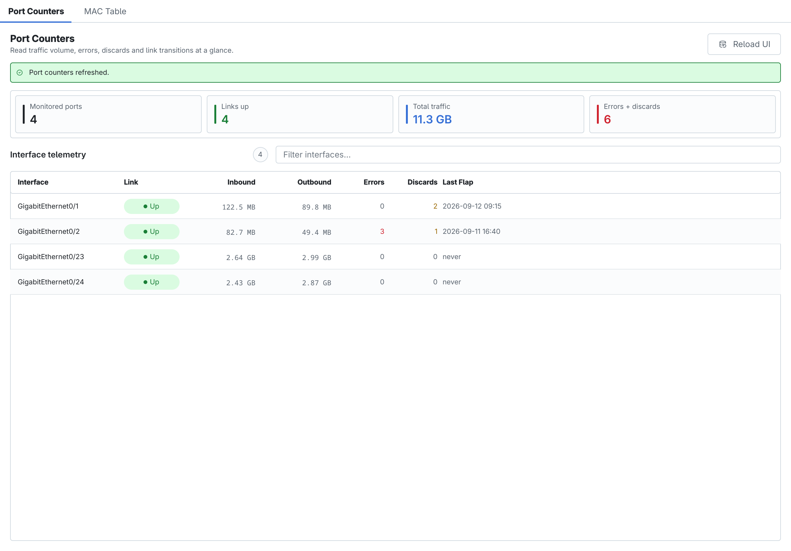
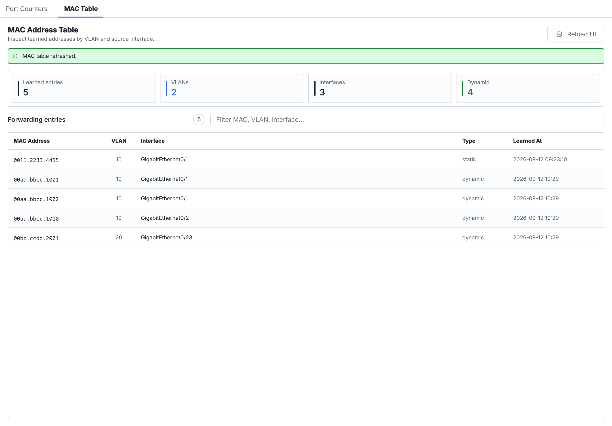

<!-- Đồng bộ tự động từ ../contents/17_giam_sat_switch_l2.typ; chạy scripts/sync_book_markdown.py để cập nhật. -->

# Giám sát Switch Layer 2

!!! note "Ghi chú"

    Nhóm **Monitoring** của SW2 gồm **Port Counters** và **MAC Table**. Hai tab này chỉ đọc dữ liệu đã thu thập; không có Save hoặc View & Push. Chọn **Reload UI** sau khi thiết bị được đồng bộ để nạp lại dữ liệu hiển thị.

## Port Counters

<figure id="fig-ch17-01-port-counters" markdown="span">
  { loading=lazy }
  <figcaption>Lưu lượng, lỗi, discard và lần link flap gần nhất theo port.</figcaption>
</figure>

| Cột | Cách đọc |
| --- | --- |
| **Interface** | Port vật lý đang được theo dõi. |
| **Link** | Trạng thái hoạt động hiện tại; Up không đồng nghĩa đường truyền không có lỗi. |
| **Inbound / Outbound** | Tổng byte nhận/gửi. So sánh tương đối giữa các port và giữa nhiều lần thu thập. |
| **Errors** | Tổng lỗi vào/ra. Giá trị tăng liên tục có thể liên quan speed/duplex, cáp, transceiver hoặc tín hiệu. |
| **Discards** | Gói bị loại dù không nhất thiết lỗi khung; cần kiểm tra nghẽn, queue và policy liên quan. |
| **Last Flap** | Lần link chuyển trạng thái gần nhất; flap lặp lại có thể chỉ ra kết nối không ổn định. |

*Port Counters*

Thanh tổng quan cho biết số port, link Up, tổng traffic và tổng Errors + Discards. Dùng ô lọc để tìm interface. Counter là giá trị tích lũy, nên một số khác 0 chưa đủ kết luận đang có sự cố; cần Reload sau một khoảng thời gian và xem tốc độ tăng.

## MAC Address Table

<figure id="fig-ch17-02-mac-address-table" markdown="span">
  { loading=lazy }
  <figcaption>Địa chỉ MAC đã học theo VLAN, interface và loại entry.</figcaption>
</figure>

| Cột | Ý nghĩa |
| --- | --- |
| **MAC Address** | Địa chỉ Layer 2 ở dạng Cisco. |
| **VLAN** | VLAN nơi MAC được học hoặc được gán tĩnh. |
| **Interface** | Port hoặc uplink dẫn tới địa chỉ đó. |
| **Type** | `dynamic`, `static`, `sticky` hoặc `secure` tùy nguồn dữ liệu. |
| **Learned At** | Thời điểm ghi nhận entry trong dữ liệu CAMS. |

*MAC Address Table*

Dùng ô lọc theo MAC, VLAN hoặc interface. Nếu nhiều MAC người dùng xuất hiện trên một access port chỉ dành cho một máy, kiểm tra xem có switch ngoài ý muốn hay không. Nhiều MAC trên trunk/uplink là bình thường. Khi một MAC di chuyển giữa các port, đối chiếu topology, STP, EtherChannel và thời gian thu thập trước khi xử lý.
