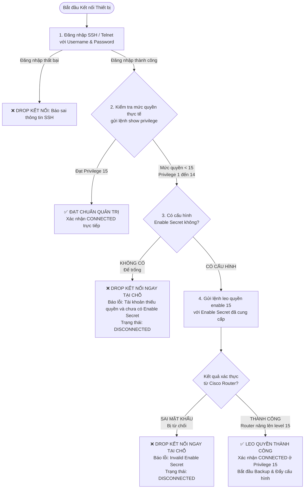

# BÁO CÁO KỸ THUẬT: TÍCH HỢP XÁC THỰC MẬT KHẨU ENABLE & KIỂM SOÁT ĐẶC QUYỀN (PRIVILEGE 15) TRONG CAMS

**Hệ thống:** CAMS (Cisco Automation & Management System)  
**Thời gian thực hiện:** Tháng 10/2026  
**Chủ đề:** Tích hợp Mật khẩu Cấp quyền (`Enable Password / Secret`), Khắc phục Cơ chế Nhận diện Đặc quyền Cisco IOS và Chuẩn hóa Quy trình Kết nối 2 Bước An toàn.

---

## 1. Tổng quan Vấn đề Kỹ thuật Ban đầu

Trong quá trình vận hành thực nghiệm với các thiết bị mạng Cisco IOS (Router & Switch), hệ thống CAMS phát sinh một số vấn đề cốt lõi về xác thực và kiểm soát quyền hạn:

1. **Khuyết thiếu trường nhập Mật khẩu Cấp quyền (`Enable Password / Enable Secret`):**
   - Trước đây CAMS chỉ lưu trữ `Username` và `Password` SSH. 
   - Trong môi trường doanh nghiệp thực tế, các chính sách bảo mật (Security Policy) nghiêm cấm tài khoản SSH đăng nhập trực tiếp với quyền `Privilege 15`. Mọi tài khoản khi SSH vào chỉ ở mức quyền thường (`Privilege 1`), muốn thực thi tác vụ cấu hình bắt buộc phải gõ lệnh `enable` và nhập `Enable Secret`. CAMS trước đó không có trường này nên không thể quản trị các thiết bị có cấu hình Enable Secret độc lập.

2. **Cạm bẫy nhận diện Prompt `#` trong Cisco IOS (Role-Based CLI - Privilege 2–14):**
   - Khi tài khoản được phân quyền ở mức trung gian (ví dụ tài khoản `Kien` với `privilege 5`), Cisco IOS tự động hiển thị dấu nhắc lệnh là `R2#` (kết thúc bằng `#` cho mọi mức quyền từ 2 đến 15).
   - Thư viện tự động hóa chuẩn Netmiko (`check_enable_mode()`) chỉ kiểm tra xem dấu nhắc có ký tự `#` hay không. Do thấy `R2#`, hệ thống nhận định nhầm phiên làm việc đã ở quyền tối cao (Privilege 15) và bỏ qua bước leo quyền `enable()`.
   - Kết quả: Khi CAMS gửi lệnh `show running-config` hoặc `configure terminal`, Router từ chối lệnh và trả về lỗi:
     ```text
     % Invalid input detected at '^' marker.
     ```

3. **Chuỗi nạp thông tin thiết bị bị khuyết cột dữ liệu:**
   - Dù cơ sở dữ liệu đã bổ sung cột `enable_password`, nhưng các tầng trung gian gồm `DeviceRepository.get_login()`, `DeviceLoginService.load()` và `create_connector()` đều không truy vấn và không truyền trường này.
   - Hàm `DeviceConnector.connect()` cũ tự động fallback ngầm `secret = password`, gây hiểu lầm rằng thiết bị không cần Enable Secret vẫn kết nối được.

4. **Thiếu chốt chặn kiểm soát đặc quyền ban đầu (Không DROP kết nối):**
   - Khâu `connect()` ban đầu chỉ xác thực xem SSH có thông hay không; nếu SSH đăng nhập thành công là đánh dấu `CONNECTED` ngay lập tức, bất kể tài khoản đó có đủ quyền quản trị hay không.

---

## 2. Mô hình Kiến trúc & Quy trình Kiểm soát 2 Bước Mới

Hệ thống đã được thiết kế lại theo quy trình kiểm tra 2 bước nghiêm ngặt ngay tại thời điểm khởi tạo kết nối:



---

## 3. Chi tiết Mã nguồn và Các File Thay đổi

### A. Tầng Cơ sở Dữ liệu & Quản lý Thiết bị (Database & Core Slots)

#### 1. Schema Cơ sở Dữ liệu
* **File:** [`infrastructure/database/schemas/device_network/01_core_devices.sql`](file:///data/Projects/CAMS_2/infrastructure/database/schemas/device_network/01_core_devices.sql)
* **Thay đổi:** Thêm cột `enable_password TEXT DEFAULT ''` vào bảng `t01_devices`.

#### 2. Tự động Migration & Cập nhật Slots
* **File:** [`core/database/device_slots.py`](file:///data/Projects/CAMS_2/core/database/device_slots.py)
* **Thay đổi:**
  - Tự động chạy `ALTER TABLE t01_devices ADD COLUMN enable_password TEXT DEFAULT ''` nếu mở cơ sở dữ liệu cũ (tương thích ngược 100%).
  - Nạp chồng `@pyqtSlot` cho `addDevice` và `updateDevice` hỗ trợ tham số thứ 10 (`enable_pass`).
  - Cập nhật `getDeviceByHost()` trả về trường `enable_pass` để QML hiển thị lại khi Sửa thiết bị.
  - Cập nhật `addDevicesBatch()` hỗ trợ nhập hàng loạt kèm Enable Secret.

#### 3. Nhập dữ liệu hàng loạt (Batch Import)
* **File:** [`core/database/device_import_slots.py`](file:///data/Projects/CAMS_2/core/database/device_import_slots.py)
* **Thay đổi:** Hỗ trợ ánh xạ cột `enable_password` / `enable_secret` / `enable_pass` khi nhập từ Excel hoặc JSON.

#### 4. Kho lưu trữ thiết bị (Device Repository)
* **File:** [`features/devices/repository.py`](file:///data/Projects/CAMS_2/features/devices/repository.py)
* **Thay đổi:** Bổ sung `COALESCE(enable_password, '') AS enable_password` vào truy vấn SQL:
  ```python
  SELECT host, device_name, method, portnumber, username, password,
         COALESCE(enable_password, '') AS enable_password, os, role, dev
  FROM t01_devices
  WHERE host = ?;
  ```

---

### B. Tầng Dịch vụ Mạng & Điều khiển Kết nối (Network Infrastructure)

#### 1. Dịch vụ Nạp Thông tin Đăng nhập (Device Login Service)
* **File:** [`features/devices/login_service.py`](file:///data/Projects/CAMS_2/features/devices/login_service.py)
* **Thay đổi:** Trích xuất và ánh xạ trường `secret` và `enable_password`:
  ```python
  "secret": row.get("enable_password") or "",
  "enable_password": row.get("enable_password") or "",
  ```

#### 2. Factory Khởi tạo Connector
* **File:** [`infrastructure/network/connector.py`](file:///data/Projects/CAMS_2/infrastructure/network/connector.py)
* **Thay đổi:** Truyền tham số `secret` vào `DeviceConnector`:
  ```python
  return DeviceConnector(
      device["host"],
      device["method"],
      device["port"],
      device["username"],
      device["password"],
      secret=device.get("secret") or device.get("enable_password") or "",
      device_type=device["device_type"],
      ...
  )
  ```

#### 3. Module Chuyên dụng Leo quyền & Xác thực Đặc quyền (MỚI)
* **File:** [`infrastructure/network/privilege.py`](file:///data/Projects/CAMS_2/infrastructure/network/privilege.py)
* **Nội dung:**
  - `ensure_privileged_mode(connection)`: Dùng trong suốt vòng đời phiên làm việc để đảm bảo trạng thái Privilege 15 trước mỗi lệnh cấu hình.
  - `ensure_initial_privilege(connection, secret, username)`: Thực thi quy trình kiểm soát 2 bước khi khởi tạo kết nối:
    1. Kiểm tra lệnh `show privilege` trên router.
    2. Nếu đã là mức 15 $\rightarrow$ Cho phép kết nối.
    3. Nếu mức $< 15$:
       - Nếu không có `secret` $\rightarrow$ Ném ngoại lệ `PermissionError` (kết nối bị DROP).
       - Nếu có `secret` $\rightarrow$ Gửi `enable 15`. Nếu sai pass hoặc bị từ chối $\rightarrow$ Ném ngoại lệ `PermissionError` (kết nối bị DROP).
       - Nếu thành công $\rightarrow$ Xác nhận lại bằng `show privilege` để đảm bảo chắc chắn ở level 15.

#### 4. Trình Điều hợp Thiết bị (Device Connector)
* **File:** [`infrastructure/network/device_connector.py`](file:///data/Projects/CAMS_2/infrastructure/network/device_connector.py)
* **Thay đổi:**
  - **Xóa bỏ hoàn toàn việc fallback ngầm:** Không tự gán `secret = password` nếu không có `secret`.
  - Trong hàm `connect()`, ngay sau khi mở kết nối SSH, gọi `ensure_initial_privilege`:
    ```python
    self.connection = connect_device({**device_params, "method": self.method}, self.db_path)
    from .privilege import ensure_initial_privilege
    ensure_initial_privilege(self.connection, self.secret, self.username)
    self.connected = True
    ```
  - Bổ sung khối bắt ngoại lệ `except PermissionError as exc:` $\rightarrow$ ghi nhận `last_error`, gọi `self.disconnect()` và trả về `False`.
  - Trong `enter_config_mode()`, gọi `ensure_privileged_mode(self.connection)` trước khi vào `config_mode()`.

#### 5. Quản lý Phiên tập trung (Session Registry)
* **File:** [`infrastructure/network/session_registry.py`](file:///data/Projects/CAMS_2/infrastructure/network/session_registry.py)
* **Thay đổi:** Trong hàm `_prepare(connector)`, thay thế việc kiểm tra lỏng lẻo bằng `ensure_privileged_mode(connection)`. Nếu kết nối không đạt Privilege 15, phiên bị đánh dấu `error` và thiết bị hiển thị `DISCONNECTED`.

#### 6. Thu thập Cấu hình Running-Config (Running Config Collector)
* **File:** [`infrastructure/network/running_config_collector.py`](file:///data/Projects/CAMS_2/infrastructure/network/running_config_collector.py)
* **Thay đổi:**
  - Leo quyền Privilege 15 trước khi gửi `show running-config`.
  - Thêm cơ chế kiểm tra kết quả trả về: Nếu Cisco trả về `% Invalid input detected` hoặc `% Authorization failed` $\rightarrow$ Bắn `RuntimeError` báo lỗi, ngăn chặn không cho lưu văn bản lỗi vào file backup snapshot.

#### 7. Tác vụ Đẩy cấu hình Nornir (Nornir Netmiko Tasks)
* **File:** [`infrastructure/network/nornir_netmiko_tasks.py`](file:///data/Projects/CAMS_2/infrastructure/network/nornir_netmiko_tasks.py)
* **Thay đổi:** Trong `netmiko_send_config` và `netmiko_send_command`, khi cờ `enable=True`, tự động gọi `ensure_privileged_mode(connection)` để đảm bảo mọi lệnh cấu hình đều được thực thi ở Privilege 15.

#### 8. Các Worker Tính năng Nornir
* **Files:**
  - [`features/acl/worker.py`](file:///data/Projects/CAMS_2/features/acl/worker.py)
  - [`features/dhcp/worker.py`](file:///data/Projects/CAMS_2/features/dhcp/worker.py)
  - [`features/nat/worker.py`](file:///data/Projects/CAMS_2/features/nat/worker.py)
  - [`features/routing/worker.py`](file:///data/Projects/CAMS_2/features/routing/worker.py)
* **Thay đổi:** Tự động truy vấn cột `enable_password` từ Database và nạp vào cấu hình `connection_options["cams_netmiko"]["extras"]["secret"]`.

---

### C. Tầng Giao diện Người dùng (QML User Interface)

* **File:** [`UI/qml/sidebar/new_device/NewDevice.qml`](file:///data/Projects/CAMS_2/UI/qml/sidebar/new_device/NewDevice.qml)
* **Thay đổi:**
  - Tăng chiều cao hộp thoại từ `620px` lên `670px` để giao diện thoáng đẹp, không bị đè nút.
  - Thêm ô mật khẩu chuẩn `StandardPasswordField`:
    - **Nhãn hiển thị:** `Enable Password / Secret:`
    - **Gợi ý mờ (Placeholder):** `(Tùy chọn, mặc định = Password)`
    - **Biểu tượng:** Hỗ trợ nút ẩn/hiện mật khẩu.
  - Tự động điền dữ liệu `enable_pass` cũ khi nhấn chuột phải chọn **Edit** (hoặc `F2`) trên thiết bị.
  - Đồng bộ khi nhấn phím `Enter` hoặc click nút **Save Changes**.

---

## 4. Kết quả Kiểm thử Tự động (Verification & Test Suite)

Đã xây dựng bộ kiểm thử tự động chuyên sâu tại [`tests/unit/test_privilege_escalation.py`](file:///data/Projects/CAMS_2/tests/unit/test_privilege_escalation.py) bao gồm 12 kịch bản:

| STT | Kịch bản Kiểm thử | Kết quả mong đợi | Trạng thái |
|:---:|:---|:---|:---:|
| 1 | Tài khoản Privilege 1 (Prompt `>`) | Gọi hàm `enable()` leo quyền | ✅ PASSED |
| 2 | Tài khoản Privilege 15 (Prompt `#`, level = 15) | Bỏ qua không gọi thừa lệnh `enable()` | ✅ PASSED |
| 3 | Tài khoản Privilege 5 (Prompt `#`, level = 5) | Tự động phát hiện và ép gọi `enable 15` | ✅ PASSED |
| 4 | Tài khoản Privilege 5 leo quyền thất bại | Báo lỗi `RuntimeError` | ✅ PASSED |
| 5 | Kết nối đang ở chế độ Config mode | Tự động thoát về EXEC (`exit_config_mode`) trước | ✅ PASSED |
| 6 | Kiểm tra kết nối ban đầu: Quyền 15 không cần Enable Secret | Cho phép kết nối thành công | ✅ PASSED |
| 7 | **Kiểm tra kết nối ban đầu: Quyền 5 không điền Enable Secret** | **Ném PermissionError, DROP kết nối** | ✅ PASSED |
| 8 | **Kiểm tra kết nối ban đầu: Quyền 5 điền SAI Enable Secret** | **Ném PermissionError, DROP kết nối** | ✅ PASSED |
| 9 | **Kiểm tra kết nối ban đầu: Quyền 5 điền ĐÚNG Enable Secret** | **Leo lên quyền 15 và cho phép kết nối** | ✅ PASSED |
| 10 | `DeviceRepository.get_login()` truy vấn DB | Lấy đúng cột `enable_password` | ✅ PASSED |
| 11 | `DeviceLoginService.load()` ánh xạ dữ liệu | Chuyển đúng `secret` và `enable_password` | ✅ PASSED |
| 12 | `create_connector()` khởi tạo | Gắn đúng `secret` vào đối tượng Connector | ✅ PASSED |

**Kết quả chạy toàn bộ 41 tests liên quan:**
```bash
.venv/bin/python -m unittest tests/unit/test_device_connector.py \
                             tests/unit/test_running_config_collector.py \
                             tests/test_session_registry_concurrency.py \
                             tests/test_session_registry_shutdown.py \
                             tests/test_ssh_algorithm_override.py \
                             tests/unit/test_privilege_escalation.py
----------------------------------------------------------------------
Ran 41 tests in 0.283s

OK
```

---

## 5. Giá trị Học thuật & Ứng dụng Thực tiễn trong Đồ án / Báo cáo NCKH

1. **Tuân thủ Chuẩn mực An ninh Quốc tế:**
   - Đáp ứng chuẩn **CIS Cisco IOS Benchmark** (Mục 1.1: Password & Privilege Security) và khuyến nghị của **NIST SP 800-123**.
   - Khắc phục lỗ hổng gán nhầm đặc quyền trong quản trị tự động hóa.

2. **Nguyên lý Zero-Trust Privilege Verification:**
   - Không tin tưởng mù quáng vào ký tự prompt kết thúc (`#`) của thiết bị mạng.
   - Luôn chủ động kiểm chứng mức đặc quyền thực tế từ nhân hệ điều hành (`show privilege`) trước khi thực hiện bất kỳ lệnh can thiệp cấu hình nào.

3. **Cơ chế Xử lý Lỗi Tinh gọn (Graceful Degradation):**
   - Khi tài khoản không đủ quyền hoặc sai mật khẩu Enable, hệ thống ngắt phiên sạch sẽ (`disconnect()`), chuyển trạng thái về `DISCONNECTED` kèm cảnh báo trực quan cho người dùng thay vì treo tiến trình hoặc lưu dữ liệu lỗi vào Git snapshot.
