# CHƯƠNG 2: CƠ SỞ LÝ THUYẾT VÀ CÔNG NGHỆ NỀN TẢNG

## 2.1. Quản lý cấu hình và tự động hóa mạng

Trong kiến trúc tổng thể của hệ thống mạng máy tính, các thiết bị định tuyến (Router) và chuyển mạch (Switch) đóng vai trò trung tâm trong việc chuyển tiếp lưu lượng, phân tách các miền mạng, thiết lập đường đi cho gói tin và thực thi các chính sách bảo mật. Để duy trì sự vận hành ổn định và liên tục của hạ tầng, người quản trị hệ thống phải gánh vác khối lượng lớn các tác vụ nghiệp vụ như khai báo địa chỉ IP, thiết lập thông số giao diện, cấu hình giao thức định tuyến, triển khai dịch vụ cấp phát địa chỉ động, kiểm soát truy cập, biên dịch địa chỉ, sao lưu cấu hình định kỳ và theo dõi trạng thái thiết bị. 

Đối với mô hình quản trị truyền thống, kỹ sư mạng thường kết nối trực tiếp đến từng thiết bị thông qua giao diện dòng lệnh (CLI). Mặc dù phương pháp này đem lại khả năng kiểm soát chi tiết ở cấp độ câu lệnh, nó bộc lộ hạn chế nghiêm trọng khi quy mô hệ thống mở rộng. Việc lặp đi lặp lại cùng một chuỗi câu lệnh trên nhiều thiết bị không chỉ làm suy giảm hiệu suất lao động mà còn gia tăng rủi ro sai sót do yếu tố con người, chẳng hạn như nhầm lẫn địa chỉ IP, khai báo sai mặt nạ mạng hoặc cấu hình nhầm giao diện. Hơn thế nữa, sự thiếu vắng một cơ sở dữ liệu quản trị tập trung khiến cấu hình thực tế trên thiết bị dễ bị phân tán và phát sinh hiện tượng sai lệch cấu hình (configuration drift) so với thiết kế ban đầu.

Nhằm khắc phục triệt để các bất cập trên, phương pháp quản lý tập trung hướng tới việc hợp nhất thông tin thiết bị, trạng thái kết nối, dữ liệu cấu hình và lịch sử thao tác về một phần mềm quản trị duy nhất. Trong hệ thống CAMS, danh mục quản lý được tổ chức chặt chẽ thành ba nhóm thành phần chính bao gồm: danh mục thiết bị (inventory) mô tả thông tin định danh của các node mạng, lớp kết nối (connection) định nghĩa phương thức phần mềm giao tiếp với thiết bị, và dữ liệu cấu hình (configuration) chứa các tham số nghiệp vụ người dùng muốn áp dụng. Cách phân tách trừu tượng này giúp cô lập thông tin quản trị khỏi logic truyền thông đa giao thức, tạo tiền đề vững chắc cho cấu trúc mã nguồn dạng module.

### 2.1.1. Tự động hóa mạng trong hạ tầng viễn thông

Tự động hóa mạng đại diện cho việc ứng dụng phần mềm để hỗ trợ hoặc thực thi tự động các tác vụ quản trị vốn được tiến hành thủ công bằng tay. Mục tiêu cốt lõi của tự động hóa không phải là loại bỏ hoàn toàn vai trò của kỹ sư mạng, mà là phân giao các thao tác lặp lại mang tính quy chuẩn — như kiểm tra định dạng dữ liệu, sinh tập lệnh CLI, khởi tạo phiên kết nối, đẩy cấu hình và thu thập phản hồi — cho máy tính xử lý, trong khi quyền quyết định phê duyệt cuối cùng vẫn thuộc về con người.

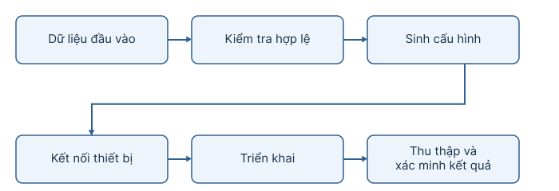

Quy trình cấu hình tự động được chuẩn hóa qua các bước nối tiếp nhau bao gồm tiếp nhận dữ liệu đầu vào, kiểm tra tính hợp lệ, sinh cấu hình tương ứng, khởi tạo kết nối thiết bị, triển khai tập lệnh và thu thập xác minh kết quả. So với thao tác dòng lệnh truyền thống, tự động hóa mang lại ưu thế vượt trội trong việc chuẩn hóa dữ liệu, loại bỏ tác vụ lặp, áp dụng chính sách đồng bộ cho hàng loạt thiết bị và duy trì vết vết lịch sử phục vụ công tác kiểm tra. Tuy nhiên, tự động hóa cũng đặt ra yêu cầu khắt khe về an toàn hệ thống, bởi một lỗi logic trong phần mềm có thể lan truyền và làm gián đoạn đồng thời nhiều thiết bị. Do đó, hệ thống bắt buộc phải tích hợp bộ xác thực dữ liệu (validation), cơ chế xem trước (preview), kiểm soát tần suất xử lý đồng thời và khả năng khoanh vùng sự cố trên từng thiết bị.

### 2.1.2. Mô hình quản lý cấu hình theo trạng thái (State-driven Configuration Management)

Trong lý thuyết quản lý cấu hình hiện đại, điểm mấu chốt là sự phân định rõ ràng giữa trạng thái đang tồn tại thực tế trên thiết bị và trạng thái mong muốn do người quản trị thiết lập. Trạng thái hiện tại (Current State) biểu diễn dữ liệu cấu hình được thu thập hoặc quan sát trực tiếp từ thiết bị tại một thời điểm nhất định. Trạng thái mong muốn (Desired State) phản ánh các tham số mà người quản trị hướng tới; ví dụ, khi kỹ sư thay đổi địa chỉ IP trên giao diện phần mềm nhưng chưa thực thi xuống router, dữ liệu này mới chỉ tồn tại dưới dạng trạng thái mong muốn. Cấu hình chờ (Pending Configuration) đại diện cho phần dữ liệu đã chỉnh sửa nhưng chưa được đồng bộ. Bước xem trước (Preview) đảm nhận việc chuyển đổi trạng thái mong muốn thành các câu lệnh CLI tương ứng để người dùng kiểm duyệt nội dung. Quá trình đẩy cấu hình (Push/Apply) thực hiện gửi tập tập lệnh xuống thiết bị, và bước xác minh (Verify) kiểm tra lại phản hồi để đảm bảo trạng thái thực tế đã phù hợp với mong muốn.

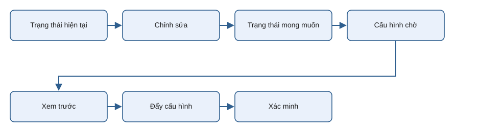

Sự phân tách giữa các trạng thái đảm bảo rằng thao tác chỉnh sửa trên giao diện đồ họa không lập tức can thiệp hay làm biến đổi thiết bị thật. Đây là nguyên tắc nền tảng của hệ thống CAMS, cho phép kỹ sư chuẩn bị dữ liệu cấu hình, kiểm tra kỹ lưỡng cú pháp trước khi chủ động phát lệnh triển khai. Bên cạnh đó, việc lưu trữ lịch sử cấu hình cần được phân biệt rõ ràng với cơ chế khôi phục tự động (rollback): việc duy trì các bản sao phiên bản cũ cung cấp dữ liệu tham chiếu trực quan, nhưng để thực hiện rollback tự động hoàn chỉnh đòi hỏi phần mềm phải có engine sinh tập lệnh phủ định tương ứng.

---

## 2.2. Giao diện dòng lệnh và giao thức quản trị thiết bị

### 2.2.1. Giao diện dòng lệnh CLI và cơ chế phân tích cú pháp (Parser)

Hệ điều hành Cisco IOS và nhiều hệ điều hành mạng chuyên dụng được thiết kế dựa trên giao diện dòng lệnh phân cấp theo từng chế độ làm việc (mode). Mỗi chế độ cung cấp một ngữ cảnh thực thi riêng biệt, bao gồm Chế độ người dùng (User EXEC - `Router>`), Chế độ đặc quyền (Privileged EXEC - `Router#`), Chế độ cấu hình toàn cục (Global Configuration - `Router(config)#`), Chế độ cấu hình giao diện (Interface Configuration - `Router(config-if)#`) và Chế độ cấu hình định tuyến (Routing Configuration - `Router(config-router)#`).

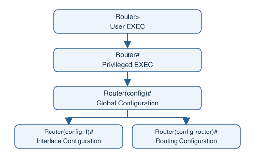

Tính phân cấp này quy định rằng một câu lệnh chỉ có hiệu lực trong đúng ngữ cảnh của nó. Ví dụ, câu lệnh khai báo địa chỉ IP `ip address` chỉ hợp lệ tại chế độ cấu hình giao diện, trong khi câu lệnh hiển thị bảng định tuyến `show ip route` chỉ được chấp nhận tại chế độ EXEC. Do đó, một phần mềm tự động hóa mạng không thể chỉ gửi chuỗi văn bản thuần túy, mà phải có khả năng nhận diện dấu nhắc dòng lệnh (prompt) và chuyển đổi linh hoạt giữa các chế độ cấu hình.

Đặc thù của CLI là dữ liệu trả về luôn ở dạng văn bản thô không cấu trúc. Để trích xuất thông tin cấu hình đang chạy (`running-config`) hay bảng định tuyến, hệ thống phải tích hợp các bộ phân tích cú pháp (Parser) nhằm chuyển đổi luồng văn bản thành các đối tượng dữ liệu quan hệ có cấu trúc. Mặt khác, bản chất duy trì trạng thái của CLI đặt ra thách thức lớn khi xử lý đồng thời: nếu nhiều tiến trình gửi lệnh đan xen vào cùng một kênh kết nối mà không có cơ chế khóa đồng bộ, hiện tượng tranh chấp luồng lệnh (Race Condition) sẽ xảy ra, gây sai lệch nghiêm trọng trong vận hành.

### 2.2.2. Các giao thức truyền thông an toàn (SSH và Telnet)

Giao thức Secure Shell (SSH), được mô tả chi tiết trong RFC 4251, là chuẩn truyền thông mã hóa được ưu tiên hàng đầu cho các tác vụ quản trị từ xa. SSH thiết lập kênh truyền bảo mật dựa trên các thuật toán mã hóa bất đối xứng và đối xứng, bảo vệ toàn bộ thông tin xác thực lẫn dữ liệu trao đổi giữa phần mềm quản trị và thiết bị mạng.

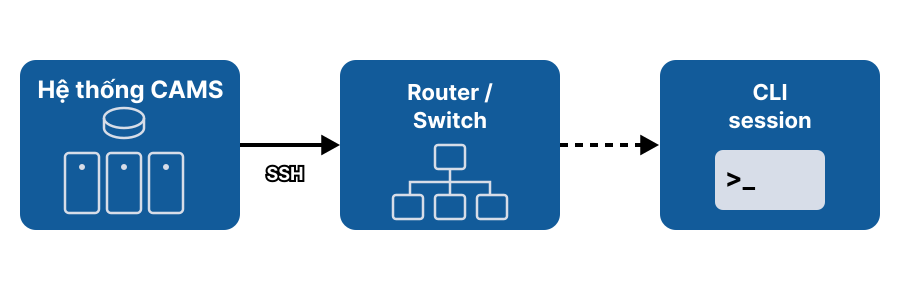

Ngược lại, giao thức Telnet truyền đưa dữ liệu dưới dạng văn bản rõ (plain-text), khiến thông tin tài khoản và mật khẩu dễ bị đánh cắp thông qua các kỹ thuật bắt gói tin trên đường truyền. Trong môi trường vận hành thực tế, Telnet bị hạn chế tối đa và SSH được quy định là tiêu chuẩn bắt buộc. Tuy nhiên, trong các phòng lab thử nghiệm hoặc đối với các dòng thiết bị cũ, Telnet vẫn được duy trì như một phương thức kết nối dự phòng.

Việc so sánh giữa hai giao thức dựa trên các tiêu chí kỹ thuật cốt lõi cho thấy SSH vượt trội hoàn toàn về khả năng bảo mật nội dung phiên làm việc thông qua việc mã hóa toàn bộ dữ liệu trên cổng TCP mặc định 22, trong khi Telnet sử dụng cổng TCP 23 mà không có bất kỳ cơ chế bảo vệ nào. Trong môi trường phát triển ứng dụng Python, các thư viện như Paramiko và Netmiko cung cấp lớp trừu tượng hóa mạnh mẽ để quản lý kết nối SSH, xử lý xác thực, tự động nhận diện prompt và gửi tập lệnh an toàn xuống thiết bị.

### 2.2.3. Vòng đời phiên quản trị và bài toán đăng ký phiên (Session Registry)

Một phiên làm việc với thiết bị mạng thông qua giao thức SSH hoặc Telnet tuân theo một vòng đời nghiêm ngặt trải qua các giai đoạn nối tiếp: khởi tạo kết nối mạng, xác thực thông tin tài khoản, mở kênh CLI session, thực thi chuỗi câu lệnh, đọc dữ liệu phản hồi và tiến hành đóng hoặc tái sử dụng phiên kết nối.

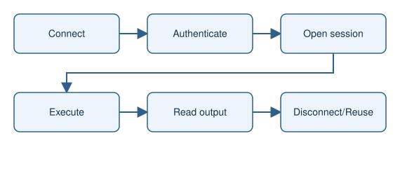

Việc khởi tạo một kết nối SSH mới cho từng câu lệnh đơn lẻ sẽ phát sinh chi phí bắt tay (handshake) và xác thực rất lớn, dẫn đến độ trễ hệ thống tăng cao. Giải pháp tối ưu là duy trì và tái sử dụng phiên kết nối hiện hành. Tuy nhiên, việc tái sử dụng đòi hỏi phần mềm phải quản lý tập trung danh mục các phiên kết nối thông qua một bộ đăng ký phiên (Session Registry). Bộ đăng ký này chịu trách nhiệm ánh xạ chính xác phiên kết nối với từng host, kiểm tra tính khả dụng của kênh truyền và áp dụng cơ chế khóa tuần tự hóa để ngăn chặn sự tranh chấp giữa các tiến trình worker.

---

## 2.3. Các nghiệp vụ mạng được hỗ trợ

### 2.3.1. Giao diện và địa chỉ IPv4

Giao diện là điểm kết nối vật lý hoặc logic của thiết bị mạng. Với giao diện Lớp 3, CAMS quản lý tên, địa chỉ IPv4, mặt nạ mạng, trạng thái `shutdown`/`no shutdown` và mô tả; các giá trị được kiểm tra trước khi sinh lệnh CLI.

Ngoài cổng vật lý, Cisco IOS còn hỗ trợ các giao diện logic như Loopback, Tunnel, Subinterface và SVI. Các giao diện này phục vụ định danh thiết bị, tạo đường hầm và định tuyến liên VLAN.

### 2.3.2. DHCP và DHCP Relay

DHCP tự động cấp địa chỉ IP và các tham số mạng cho thiết bị đầu cuối. Quá trình cấp phát gồm bốn bước DORA: Discover, Offer, Request và Acknowledge.

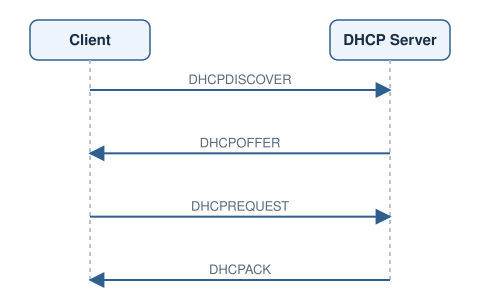

Một DHCP Pool gồm dải mạng, cổng mặc định, DNS và thời gian thuê. Lệnh `excluded-address` loại trừ địa chỉ tĩnh; `ip helper-address` chuyển tiếp yêu cầu khi client và server ở khác miền quảng bá. CAMS lưu các pool và helper address dưới dạng dữ liệu có cấu trúc để kiểm tra và sinh cấu hình.

### 2.3.3. Định tuyến tĩnh

Tuyến tĩnh xác định mạng đích cùng next-hop hoặc giao diện đầu ra. Tuyến mặc định `0.0.0.0 0.0.0.0` xử lý lưu lượng không khớp các tuyến cụ thể.

Cách định tuyến này dễ kiểm soát nhưng không tự thích ứng khi sơ đồ mạng thay đổi. CAMS cho phép nhập tham số, kiểm tra dữ liệu, xem trước lệnh và triển khai cấu hình.

### 2.3.4. OSPFv2

OSPFv2 là giao thức định tuyến trạng thái liên kết cho IPv4, sử dụng thuật toán Dijkstra để tính đường đi ngắn nhất.

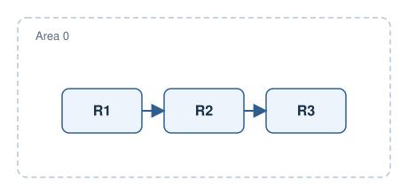

Cấu hình OSPF gồm Process ID, Router ID, Area, network statement và `passive-interface`. CAMS phải duy trì đúng quan hệ giữa tiến trình, vùng và dải mạng, đồng thời sinh lệnh theo thứ tự phụ thuộc.

### 2.3.5. EIGRP

EIGRP là giao thức định tuyến vector khoảng cách nâng cao, sử dụng thuật toán DUAL để tìm đường đi không lặp và hội tụ nhanh. Các tham số chính gồm AS, dải mạng quảng bá, giao diện thụ động và metric. CAMS bảo đảm dữ liệu lưu trữ, nội dung xem trước và cấu hình triển khai luôn nhất quán.

### 2.3.6. Danh sách kiểm soát truy cập

ACL là tập quy tắc `permit` hoặc `deny` được xét từ trên xuống; thứ tự và sequence number quyết định kết quả lọc.

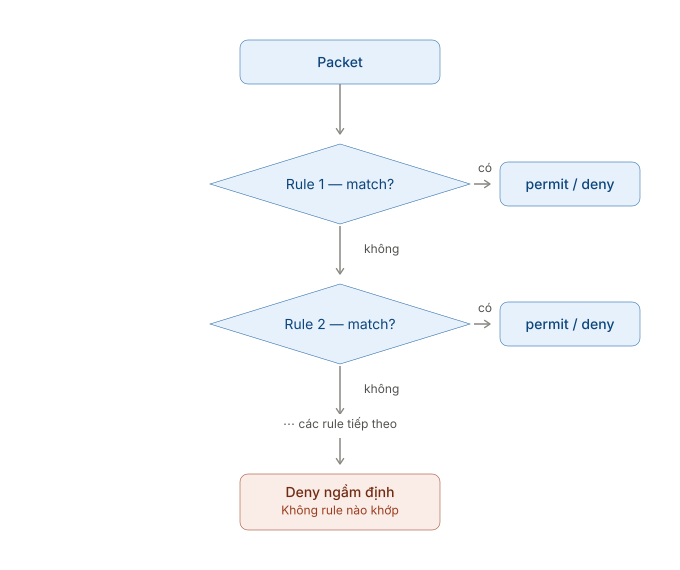

Standard ACL lọc theo địa chỉ nguồn, còn Extended ACL có thể xét giao thức, địa chỉ nguồn/đích và cổng dịch vụ. CAMS cũng hỗ trợ Dynamic ACL, Reflexive ACL và MAC ACL; mỗi ACL được lưu cùng các rule theo đúng thứ tự.

### 2.3.7. NAT và PAT

NAT chuyển đổi địa chỉ giữa các không gian mạng. Static NAT ánh xạ cố định một-một, Dynamic NAT lấy địa chỉ từ pool, còn PAT cho phép nhiều host dùng chung một địa chỉ công cộng thông qua số cổng.

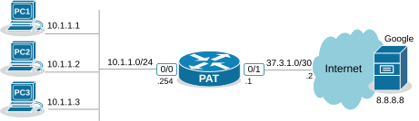

Cấu hình NAT liên quan đến vai trò `ip nat inside`/`outside`, ACL, pool và bảng ánh xạ. CAMS kiểm tra các tham chiếu này trước khi sinh lệnh.

### 2.3.8. Dự phòng cổng mặc định

Các giao thức FHRP như HSRP, VRRP và GLBP cho phép nhiều router cung cấp một cổng mặc định ảo.

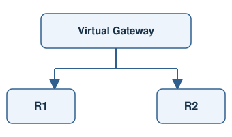

Khi router chính gặp sự cố, router dự phòng tiếp quản địa chỉ IP và MAC ảo. GLBP còn hỗ trợ phân phối lưu lượng giữa các router thành viên.

### 2.3.9. Chuyển mạch Lớp 2

VLAN chia mạng vật lý thành các miền quảng bá logic. Cổng Access phục vụ một VLAN, còn cổng Trunk mang nhiều VLAN bằng chuẩn 802.1Q.

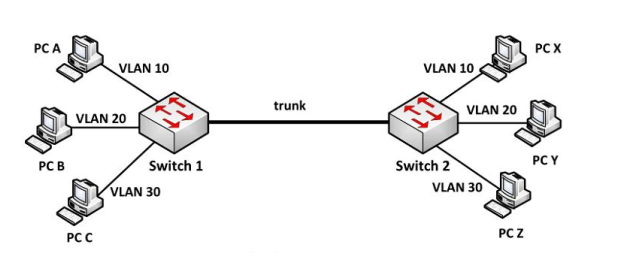

SVI cung cấp định tuyến liên VLAN trên switch đa tầng. EtherChannel dùng LACP hoặc PAgP để gộp nhiều liên kết vật lý thành một liên kết logic.

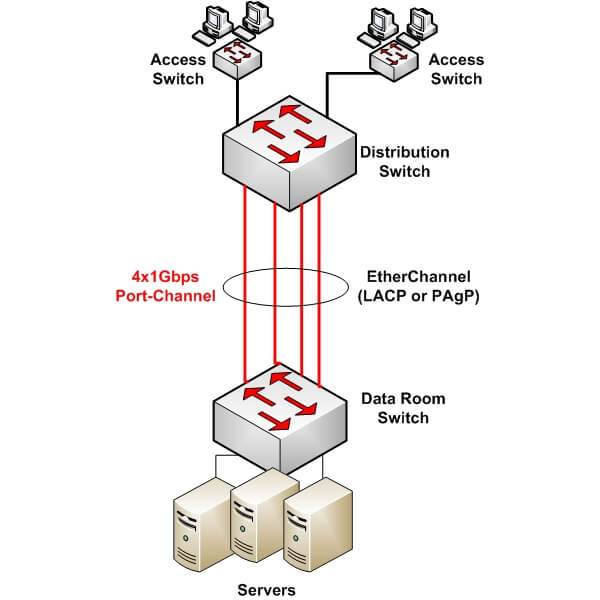

STP và các biến thể PVST+/RSTP ngăn vòng lặp bằng cách khóa các liên kết dự phòng chưa cần thiết.

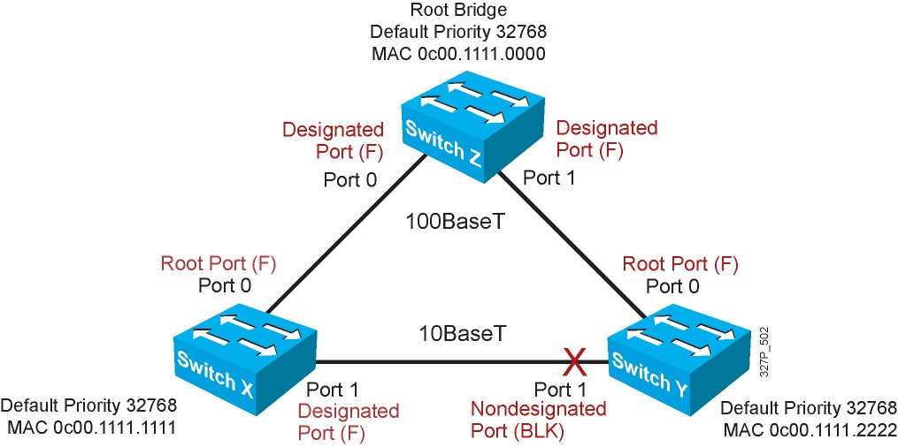

VTP đồng bộ cơ sở dữ liệu VLAN giữa các switch trong cùng miền quản trị.

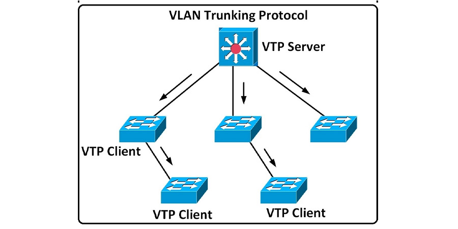

### 2.3.10. Bảo mật Lớp 2

DHCP Snooping ngăn máy chủ DHCP giả mạo bằng cách phân loại cổng Trusted/Untrusted và xây dựng bảng ánh xạ IP, MAC, VLAN và cổng vật lý.

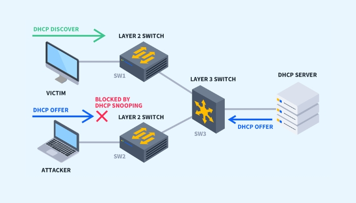

Dynamic ARP Inspection đối chiếu gói ARP với bảng của DHCP Snooping. Gói có ánh xạ IP–MAC không hợp lệ sẽ bị loại bỏ, giúp hạn chế ARP Spoofing.

---

## 2.4. Kiến trúc cơ sở dữ liệu quan hệ và SQLite

### 2.4.1. Vai trò của cơ sở dữ liệu trong hệ thống Local-first

Một phần mềm quản lý cấu hình mạng đòi hỏi khả năng lưu trữ dữ liệu bền vững vượt khỏi vòng đời của một phiên kết nối SSH. Dữ liệu hệ thống bao gồm danh mục thiết bị, thông số giao diện, bảng định tuyến, DHCP Pool, danh sách ACL, quy tắc NAT, cấu hình Switching, trạng thái Desired State và lịch sử thao tác.

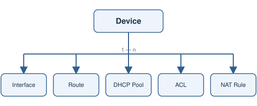

Mô hình dữ liệu quan hệ tổ chức thông tin thành các bảng chuẩn hóa: khóa chính (primary key) định danh duy nhất cho từng bản ghi, và khóa ngoại (foreign key) thể hiện mối quan hệ giữa các bảng. Quan hệ một-nhiều (1-n) phản ánh chính xác thực tế một thiết bị quản lý nhiều giao diện và nhiều chính sách nghiệp vụ, giúp loại bỏ sự trùng lặp dữ liệu và đảm bảo tính toàn vẹn hệ thống.

### 2.4.2. Hệ quản trị cơ sở dữ liệu nhúng SQLite

SQLite là hệ quản trị cơ sở dữ liệu quan hệ dạng nhúng (embedded database): toàn bộ dữ liệu được đóng gói trong các tệp đơn lẻ và ứng dụng truy xuất trực tiếp thông qua thư viện liên kết mà không cần triển khai một database server riêng biệt. Cấu trúc này phù hợp hoàn hảo với các ứng dụng vận hành cục bộ (local-first) như CAMS.

SQLite hỗ trợ đầy đủ cú pháp SQL tiêu chuẩn, cơ chế giao dịch (transaction), chỉ mục (index), ràng buộc (constraint) và khóa ngoại. Tuy nhiên, do đặc thù ghi dữ liệu theo cơ chế khóa toàn bộ tệp (file locking), khi có nhiều tiến trình worker đồng thời truy cập ghi, phần mềm cần duy trì các giao dịch ngắn và giải phóng khóa ghi ngay khi hoàn tất để tránh tắc nghẽn.

### 2.4.3. Giao dịch ACID và tính toàn vẹn dữ liệu

Giao dịch (Transaction) nhóm nhiều thao tác dữ liệu thành một đơn vị xử lý logic tuân theo các nguyên tắc ACID (Atomicity - Tính nguyên tố, Consistency - Tính nhất quán, Isolation - Tính cô lập, Durability - Tính bền vững). Trong nghiệp vụ mạng, một thao tác đẩy cấu hình thường đồng thời cập nhật bản ghi nghiệp vụ và cờ trạng thái đồng bộ; nếu sự cố xảy ra giữa chừng, giao dịch giúp cuộn ngược (rollback) dữ liệu về trạng thái an toàn ban đầu.

Các ràng buộc cấp CSDL như `NOT NULL`, `UNIQUE`, `CHECK` và `FOREIGN KEY` bảo vệ dữ liệu ở tầng lưu trữ. Tuy nhiên, chúng không thể thay thế hoàn toàn bộ xác thực nghiệp vụ (Service Validation) ở tầng ứng dụng — ví dụ, một chuỗi ký tự có thể đúng kiểu dữ liệu text nhưng lại không phải là địa chỉ IPv4 hay mặt nạ mạng hợp lệ. Do đó, hệ thống bắt buộc phải kết hợp kiểm tra logic tại tầng service trước khi ghi xuống cơ sở dữ liệu.

---

## 2.5. Nền tảng phát triển Python, Qt Quick và PyQt6

### 2.5.1. Ngôn ngữ Python trong kiến trúc tự động hóa phân lớp

Python sở hữu hệ sinh thái thư viện phong phú phục vụ truyền thông SSH, xử lý dữ liệu, render template và thao tác cơ sở dữ liệu. Trong kiến trúc CAMS, Python đảm nhận vai trò xử lý logic nghiệp vụ, tương tác với SQLite, sinh mã cấu hình, điều phối luồng worker và cung cấp cầu nối dữ liệu cho giao diện đồ họa.

Để xây dựng một phần mềm dễ bảo trì và mở rộng, mã nguồn Python phải tuân thủ kiến trúc phân lớp Clean Architecture. Tầng giao diện không được phép truy vấn SQL hoặc mở socket kết nối SSH trực tiếp; thay vào đó, hệ thống phân chia trách nhiệm rõ ràng thành các tầng Service (nghiệp vụ), Repository (truy xuất dữ liệu), Worker (thực thi mạng) và Infrastructure (hạ tầng kỹ thuật).

### 2.5.2. Công nghệ giao diện khai báo Qt Quick và QML

Qt Quick cung cấp môi trường xây dựng giao diện người dùng hiện đại dựa trên ngôn ngữ khai báo QML. Thay vì khởi tạo giao diện bằng các câu lệnh thủ tục lặp đi lặp lại, QML cho phép mô tả cấu trúc component, thuộc tính (property), ràng buộc dữ liệu (binding) và phản hồi sự kiện (signal) một cách trực quan.

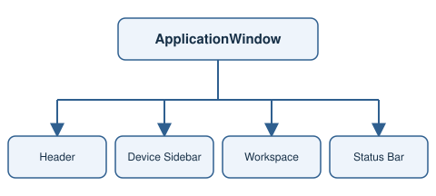

Kiến trúc component hóa giúp tái sử dụng linh hoạt các thành phần UI như Button, Dialog, Form Control và Table View. Cơ chế property binding tự động cập nhật hiển thị trên giao diện ngay khi giá trị thuộc tính ở backend thay đổi, giảm thiểu đáng kể mã nguồn quản lý trạng thái giao diện.

### 2.5.3. PyQt6 và cơ chế kết nối tín hiệu Signal/Slot

PyQt6 đóng vai trò là thư viện liên kết cho phép mã nguồn Python tương tác với framework Qt 6. Lớp `QObject` đóng vai trò là cầu nối trung tâm giữa logic xử lý Python và giao diện khai báo QML.

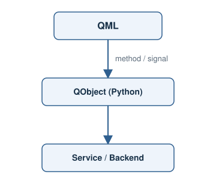

Tầng backend Python định nghĩa các slot (thông qua decorator `@pyqtSlot`) để QML gọi thực thi các hàm nghiệp vụ, đồng thời phát các tín hiệu (thông qua `pyqtSignal`) để thông báo cho QML cập nhật giao diện. Sự phối hợp giữa `pyqtSlot`, `pyqtSignal` và `Q_PROPERTY` tạo thành một hợp đồng giao tiếp (Contract) chặt chẽ giữa hai tầng phần mềm.

---

## 2.6. Các thư viện tự động hóa và quản lý phiên bản chuyên dụng

### 2.6.1. Thư viện kết nối CLI Netmiko và Paramiko

Paramiko là thư viện Python thuần túy triển khai giao thức SSHv2, quản lý các kết nối mã hóa cấp thấp. Netmiko được phát triển dựa trên Paramiko, nâng cấp thành một lớp hỗ trợ chuyên dụng cho các thiết bị mạng bằng cách tự động xử lý dấu nhắc dòng lệnh (prompt), chuyển đổi giữa các mode cấu hình và quản lý thời gian chờ (timeout).

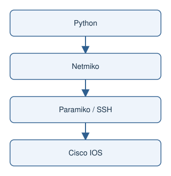

Trong thiết kế phần mềm CAMS, Netmiko và Paramiko được ẩn đằng sau lớp Adapter/Connector. Tầng dịch vụ nghiệp vụ chỉ gửi yêu cầu thực thi tập lệnh mà không cần quan tâm đến chi tiết kết nối cấp thấp, giúp dễ dàng thay thế bằng các Fake Connector phục vụ kiểm thử tự động (Unit Test).

### 2.6.2. Engine kết xuất mẫu cấu hình Jinja2

Jinja2 là một template engine mạnh mẽ giúp tách biệt hoàn toàn dữ liệu cấu hình khỏi cú pháp CLI. Các mẫu cấu hình (`.j2`) định nghĩa cấu trúc lệnh Cisco IOS chuẩn với các biến dữ liệu được đặt trong thẻ `{{ variable }}`.

Khi truyền các đối tượng dữ liệu cụ thể vào template, Jinja2 biên dịch và kết xuất ra khối lệnh CLI hoàn chỉnh. Ưu điểm vượt trội của Jinja2 là giúp tập trung toàn bộ cú pháp CLI tại hệ thống template, trong khi logic kiểm tra dữ liệu được đảm nhiệm ở tầng service.

### 2.6.3. Mô hình thực thi đa thiết bị Nornir

Nornir là framework tự động hóa mạng thuần Python cung cấp cơ chế quản lý danh mục (Inventory) và thực thi tác vụ song song trên nhiều host. Ý tưởng cốt lõi kế thừa từ Nornir là việc triển khai các tác vụ độc lập đồng thời trên nhiều thiết bị, nhưng có giới hạn số lượng worker tối đa (concurrency limit). Mô hình Batch Executor phải cô lập lỗi độc lập theo từng host, đảm bảo sự cố trên một thiết bị không làm ảnh hưởng đến tiến trình thực thi của các thiết bị còn lại.

### 2.6.4. Quản lý lịch sử và kiểm soát phiên bản bằng Dulwich

Dulwich là thư viện triển khai giao thức Git thuần túy bằng Python, cho phép phần mềm khởi tạo và quản lý các kho lưu trữ Git cục bộ mà không cần cài đặt công cụ Git client trên hệ điều hành. CAMS ứng dụng Dulwich để tự động lưu trữ cấu hình `running-config` thu thập từ thiết bị thành các bản commit theo thời gian, hỗ trợ người dùng xem lại lịch sử và so sánh sự khác biệt cấu hình (Unified Diff) một cách trực quan.

---

## 2.7. Cơ chế xử lý đồng thời và mô hình tác vụ nền

### 2.7.1. Phân tách luồng mạng khỏi luồng giao diện chính (UI Thread)

Các tác vụ giao tiếp mạng qua SSH thường mất nhiều thời gian do độ trễ đường truyền và tốc độ phản hồi của thiết bị. Nếu các lệnh kết nối và đẩy cấu hình được thực thi trực tiếp trên luồng giao diện chính (UI Thread), vòng lặp sự kiện (Event Loop) sẽ bị ngắt quãng, dẫn đến hiện tượng giao diện bị treo đứng (Freeze/Not Responding).

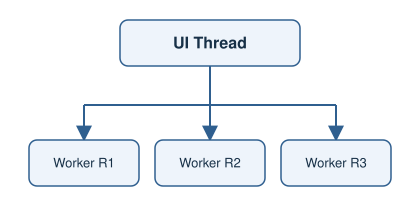

Giải pháp kiến trúc bắt buộc là đẩy toàn bộ các tác vụ mạng dài hạn sang các luồng xử lý nền (Worker Threads). Luồng UI Thread chỉ gửi yêu cầu kích hoạt và tiếp nhận kết quả phản hồi thông qua tín hiệu bất đồng bộ, giữ cho giao diện người dùng luôn phản hồi mượt mà.

### 2.7.2. Nguyên tắc khóa thiết bị (Host Lock) và điều phối song song

Khi xử lý đa nhiệm, các thiết bị mạng độc lập có thể được kết nối song song, nhưng đối với từng thiết bị đơn lẻ, việc nhiều worker đồng thời gửi lệnh vào cùng một phiên CLI sẽ gây ra tranh chấp nghiêm trọng.

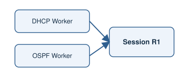

Cơ chế khóa theo thiết bị (Host Lock) áp dụng một khóa tuần tự hóa (`operation_lock`) trên từng host. Khóa này bảo đảm rằng tại một thời điểm chỉ có duy nhất một tác vụ được quyền sử dụng kênh CLI của thiết bị đó, trong khi tác vụ trên các thiết bị khác vẫn vận hành song song — tuân thủ triệt để nguyên tắc: tuần tự hóa trên cùng một host, song song giữa các host khác nhau.

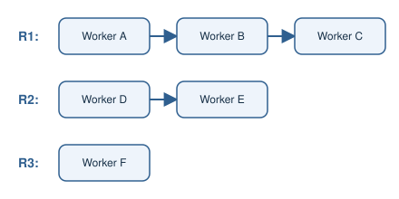

---

## 2.8. Hệ thống giám sát Syslog, SFTP và các tiện ích đồng hành

Giao thức Syslog là tiêu chuẩn phổ biến cho phép các thiết bị mạng phát tin nhắn sự kiện thời gian thực về một máy chủ thu nhận tập trung. Pipeline xử lý Syslog bao gồm thiết bị phát bản tin, bộ tiếp nhận (Syslog Receiver), bộ bóc tách dữ liệu (Parser), bộ ghi dữ liệu theo lô (Batch Writer) và giao diện truy vấn. Việc ghi dữ liệu theo lô giúp giảm tần suất giao dịch và tránh nghẽn I/O trên cơ sở dữ liệu SQLite.

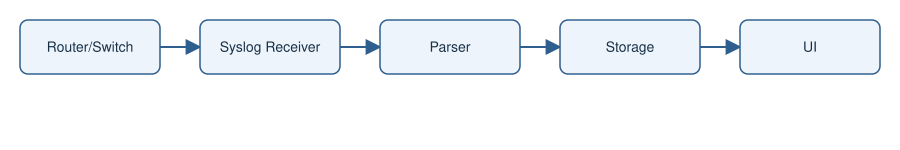

Bên cạnh Syslog, máy khách SFTP nhúng cung cấp khả năng truyền tệp an toàn giữa máy trạm và thiết bị mạng qua kênh mã hóa SSH. Do thao tác truyền tệp có thể kéo dài, tiến trình SFTP được thực thi hoàn toàn ở chế độ nền kèm theo thanh tiến trình và cờ hủy tác vụ an toàn. Các tiện ích này mở rộng phạm vi của CAMS từ một công cụ tự động hóa cấu hình thuần túy thành một hệ sinh thái quản lý và giám sát an ninh mạng tập trung hoàn chỉnh.
