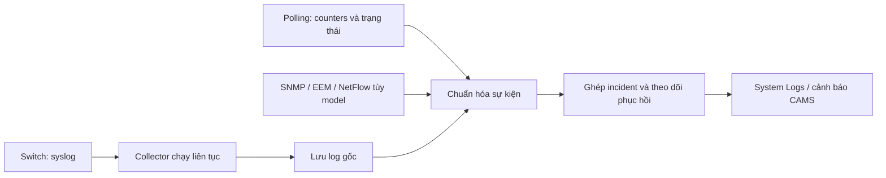

# Nghiên cứu thu nhận sự kiện an ninh lớp 2 cho CAMS

Ngày nghiên cứu: 04/10/2026. Phạm vi: đọc mã CAMS và đối chiếu tài liệu Cisco;
Mô tả hiện trạng bên dưới là snapshot trước khi cải tiến code, chưa kiểm chứng
trên switch thật. Cập nhật triển khai cùng ngày: đã thêm DAI logging theo VLAN,
outcome trên Syslog/Excel, sửa đếm permit/operational/recovery, đọc số packet
trong DAI log tổng hợp và phân loại PM theo nguyên nhân. Xem hướng dẫn hiện hành
[lab DAI/DHCP Snooping](../L2_SECURITY_SYSLOG_LAB.md). Polling, EEM tự động,
SNMP/NetFlow và service nền trong bản nghiên cứu vẫn là phương án chưa triển khai.
Môi trường được người dùng xác nhận: **vIOS L2 (IOSvL2) trên EVE-NG**; phiên bản
image cụ thể chưa được xác nhận. “Port guard” được người dùng dùng để chỉ toàn
bộ nhóm tính năng an ninh lớp 2 ngoài DHCP Snooping và DAI.

## Điều chỉnh riêng cho IOSvL2 trên EVE-NG

Cisco công bố IOSvL2 có DAI, DHCP Snooping, STP, PACL/VACL và protected port;
bài kiểm thử CML có Port Security shutdown và autorecovery. Điều này hỗ trợ
chọn các tính năng trên làm nhóm lab đầu tiên, nhưng chưa chứng minh image
EVE-NG hiện dùng phát đủ syslog cho từng vi phạm.

Guide cũng nêu SPAN và Private VLAN không được hỗ trợ; 802.1X chỉ được liệt kê
là passthrough. Vì vậy không thiết kế lab dựa vào SPAN của IOSvL2 hoặc mặc định
coi image là 802.1X authenticator. Dùng capture trên link EVE-NG để kiểm chứng
packet. Khả năng EEM, SNMP, IPSG, UDLD, storm-control và log tương ứng cần thử
trên đúng image, không suy ra từ guide Catalyst phần cứng.
[Cisco IOSvL2](https://developer.cisco.com/docs/modeling-labs/iosvl2/).

Phạm vi “tất cả security lớp 2” cần gồm cả **kiểm tra chính sách cấu hình**:
port-security, các STP guard, IPSG, storm-control/UDLD nếu image hỗ trợ,
MAC flapping, PACL/VACL, protected port, trunk/DTP/native VLAN và cổng không
sử dụng. Những chính sách như tắt DTP hoặc protected port có thể không tạo
syslog riêng cho mỗi packet bị chặn. CAMS nên tạo event cấu hình sai/bị đổi,
ghi rõ nguồn `config_audit`; packet violation chỉ báo khi có nguồn quan sát.

Khảo sát ban đầu bằng `show version`, `show logging`, `show running-config`
và các lệnh trạng thái theo từng tính năng. Tra cứu CLI help chỉ để xác định
cú pháp có mặt; sau đó phải tạo tình huống vi phạm để chứng minh hành vi.
Không đánh dấu “đã giám sát” chỉ vì switch chấp nhận lệnh cấu hình.

Ưu tiên triển khai cho lab này: (1) syslog native và phân loại đầy đủ; (2) polling
CLI + audit cấu hình; (3) EEM cho khoảng trống đã tái hiện nếu image hỗ trợ;
(4) SNMP/NetFlow và service nền theo nhu cầu thực nghiệm hoặc vận hành.

## Kết luận đề xuất

Dùng **syslog tức thời + đối soát trạng thái/bộ đếm định kỳ**, đưa cả hai nguồn
về một luồng sự kiện an ninh thống nhất. Bổ sung SNMP notification hoặc EEM theo
khả năng thiết bị. Nếu cần nhận log liên tục khi đóng CAMS, tách collector và
engine sự kiện thành dịch vụ nền, có lưu trữ và hàng đợi bền vững.

Yêu cầu “có vấn đề đều báo về hệ thống” nên được nghiệm thu theo **danh sách tình
huống trên từng model/IOS**, gồm vi phạm, chặn cổng, phục hồi và mất khả năng
giám sát. Không thể hứa một syslog cho mọi packet: thiết bị có thể gộp/rate-limit
log, có chế độ drop im lặng, và đường truyền/collector có thể gián đoạn.

## CAMS đã có gì và còn thiếu gì

Đối chiếu trực tiếp các file hiện tại:

- `features/syslog/device_config/commands.py`: cấu hình đích UDP/TCP, bật logging,
  source-interface, timestamp và sequence; severity mặc định 6.
- `native/syslog_collector/main.cpp`: nhận UDP/TCP, parse Cisco, ánh xạ IP nguồn
  vào inventory, ghi SQLite rồi phát sự kiện cho Python. TCP hiện tách frame
  bằng newline. Khi ghi DB lỗi, collector tăng dropped counter; chưa có cơ chế
  hàng đợi bền vững để phát lại message ghi thất bại trong luồng này.
- `features/syslog/security.py`: phân loại ACL, DHCP Snooping, DAI, Port Security,
  authentication, STP protection và cảnh báo CAMS.
- `features/syslog/qt/manager.py`: chuyển log đến giao diện/email và detector;
  lifecycle collector hiện gắn với ứng dụng desktop.
- `features/syslog/application/security_events.py`: đã có ngưỡng cho DHCP rogue,
  DHCP flood, DAI lặp lại và Port Security lặp lại; chưa có quy tắc STP riêng.
- `features/switching/commands.py`: bật DAI logging mặc định cho gói bị từ chối,
  đặt `log-buffer logs 1024 interval 10`, chặn policy Port Security đang bật mà
  chọn `protect`. Cần đánh giá tải và cấu hình log-buffer theo profile thiết bị;
  tăng tốc độ xuất log không đồng nghĩa tăng dung lượng buffer.
- Cấu hình STP hiện có BPDU Guard, Root Guard và Loop Guard. Syslog destination
  vẫn được thiết lập riêng; push policy bảo mật không tự tạo destination.

Các khoảng trống cụ thể:

1. `%PM-...-ERR_DISABLE` hiện chỉ được phân loại Port Security khi nội dung có
   `psecure`. Log err-disable do `bpduguard`, `dhcp-rate-limit`, `arp-inspection`
   và các nguyên nhân khác cần quy tắc ánh xạ riêng. Log gốc vẫn được nhận/lưu;
   khoảng trống nằm ở bộ lọc an ninh và xử lý sự kiện.
2. Classifier DHCP hiện nhận toàn bộ facility `DHCP_SNOOPING` rồi đưa các message
   không phải rogue vào quy tắc flood. Thông báo database operation thành công
   cũng có thể bị tính vào ngưỡng. Classifier DAI cũng chưa giới hạn rõ mnemonic
   vi phạm. Cần phân biệt violation, operational, recovery trước khi đếm.
3. Một sự cố có thể phát cả log vi phạm và log err-disable; cần gắn cùng incident,
   tránh gửi hai thông báo hoặc tính hai lần cùng một hành vi.
4. Chưa có cơ chế đối soát an ninh định kỳ trong các luồng đã xem. Đồng bộ trạng
   thái interface hiện có không thay thế được theo dõi delta bộ đếm vi phạm.
5. `docs/SYSTEM_LOGS.md` còn mô tả default severity 5; command builder và tài liệu
   giám sát an ninh hiện dùng 6. Nên đồng bộ tài liệu khi triển khai.

## Bao phủ các tính năng

| Tính năng | Sự kiện cần ghi nhận | Nguồn và điểm cần kiểm chứng |
| --- | --- | --- |
| DAI | ARP không hợp lệ, ARP ACL deny, lỗi kiểm tra MAC/IP, vượt rate làm cổng err-disable | `SW_DAI`, `PM`; kiểm tra DAI statistics/log và cấu hình per-VLAN logging |
| DHCP Snooping | Server DHCP ở cổng untrusted, mismatch/packet không hợp lệ, vượt rate, lỗi binding database | `DHCP_SNOOPING`, `PM`; danh mục message tùy IOS, đối soát statistics/database/binding |
| Port Security | MAC vi phạm, đạt giới hạn, cổng/VLAN bị chặn, phục hồi | `PORT_SECURITY`, `PM`; dùng restrict/shutdown nếu cần notification |
| BPDU Guard | Nhận BPDU trên cổng được bảo vệ, err-disable, phục hồi | `SPANTREE`, `PM`; nối log BPDU với log trạng thái cổng |
| Root Guard | Chuyển root-inconsistent, trở lại hoạt động | `SPANTREE`; đối soát inconsistent ports, không đồng nhất với err-disable |
| Loop Guard | Chuyển loop-inconsistent, unblock | `SPANTREE`; có log block/unblock, đối soát trạng thái theo VLAN |
| IP Source Guard | Drop do source IP/MAC không có binding hợp lệ, binding/filter lỗi | Phải xác định khả năng xuất dữ liệu theo model; xem Smart Logging/NetFlow hoặc counters được thiết bị cung cấp |
| Mở rộng | Storm control, UDLD, MAC flapping, 802.1X/MAB, đổi policy an ninh | Bổ sung vào capability matrix và kiểm thử riêng, không suy luận cùng khả năng trên mọi switch |

DAI có cơ chế log-buffer và xuất system message theo tốc độ giới hạn, nên dùng
counters để bổ sung số lượng drop thay vì lấy số dòng log làm số packet.
[Cisco DAI](https://www.cisco.com/c/en/us/td/docs/switches/lan/c9000/sec-crypto/fhs-sisf/fhs-and-sisf-configuration-guide/dynamic-arp-inspection.html).

DHCP Snooping có các lệnh kiểm tra statistics, database và binding; không có
cơ sở để giả định mọi loại drop đều sinh message đủ port/VLAN. Một mẫu rogue
DHCP do Cisco công bố chỉ có loại DHCP message và MAC nguồn, nên trường port
phải được phép thiếu. Có thể bổ sung bằng MAC table/binding, kèm thời điểm và
độ tin cậy; không coi ánh xạ sau sự kiện là bằng chứng chắc chắn về port lúc xảy ra.
[Cisco DHCP Snooping](https://www.cisco.com/c/en/us/support/docs/ip/dynamic-host-configuration-protocol-dhcp-dhcpv6/217055-operate-and-troubleshoot-dhcp-snooping.html),
[Cisco DAI/IPSG troubleshooting](https://www.cisco.com/c/en/us/support/docs/switches/lan-switch-software/222274-troubleshoot-dynamic-arp-inspection-dai.html).

Port Security `protect` không thông báo vi phạm theo guide Catalyst được đối chiếu;
`restrict` drop và thông báo, `shutdown` làm err-disable và thông báo. Không dựa
vào polling violation counter để hứa bù được chế độ protect trên mọi platform.
[Cisco Port Security](https://www.cisco.com/c/en/us/td/docs/switches/lan/catalyst_microswitches/software/releases/15_2_7_e/configuration_guide/security/b_1527e_security_cms_cg/configuring_port_security.html).

Root Guard block là trạng thái STP root-inconsistent và tự phục hồi khi ngừng
nhận superior BPDU; Loop Guard dùng loop-inconsistent và tự phục hồi khi BPDU
trở lại. Vì vậy incident cần theo dõi cả block và recovery, không chỉ port down.
[Cisco Root Guard](https://www.cisco.com/c/en/us/support/docs/lan-switching/spanning-tree-protocol/10588-74.html),
[Cisco Loop Guard](https://www.cisco.com/c/en/us/support/docs/lan-switching/spanning-tree-protocol-stp-8021d/218321-configure-stp-with-loop-guard-and-bpdu-s.html).

## So sánh phương pháp

| Phương pháp | Lợi ích | Giới hạn | Vai trò đề xuất |
| --- | --- | --- | --- |
| Syslog native UDP/TCP | Nhanh, có nguyên nhân, tận dụng collector CAMS | Phụ thuộc message được thiết bị phát; UDP có thể mất; TCP không xác nhận commit DB | Nguồn chính |
| Polling CLI/SNMP | Phát hiện counters tăng và trạng thái chặn còn tồn tại dù thiếu log | Có độ trễ; transient giữa hai lần poll có thể mất; trường dữ liệu tùy model | Nguồn đối soát |
| SNMP traps/informs | Thông tin có cấu trúc, bổ sung notification cổng và err-disable | Cần receiver và MIB/OID mapping; không có notification cho mọi loại drop | Bổ sung sau |
| EEM trên switch | Đọc trạng thái/counter hoặc phản ứng event rồi sinh custom syslog | Khả năng IOS, quyền CLI/AAA, tải CPU và parsing output cần kiểm chứng | Bù khoảng trống cụ thể |
| Smart Logging/NetFlow | Có thể bổ sung thông tin packet vi phạm, đặc biệt IPSG | Cần NetFlow exporter/collector và model hỗ trợ | Nguồn tùy chọn |
| Packet capture trên link EVE-NG | Bằng chứng chi tiết để điều tra trong lab | Nhiều dữ liệu; placement ảnh hưởng packet thấy được; IOSvL2 không hỗ trợ SPAN theo guide | Kiểm chứng, điều tra |

SNMP informs có acknowledgment và retry, traps không có acknowledgment; vẫn
phải kiểm tra loại notification cụ thể có hỗ trợ informs trên thiết bị hay không.
CAMS cần listener SNMP riêng, không gửi SNMP trực tiếp vào port syslog.
[Cisco SNMP notifications](https://www.cisco.com/en/US/docs/ios-xml/ios/snmp/configuration/15-0s/nm-snmp-cfg-snmp-support.html).

EEM hỗ trợ event detector và action syslog. EEM chỉ bắt lại syslog đã có thì
không giải quyết drop im lặng; muốn bù phải có nguồn event/counter/state khác.
Thiết kế chỉ phát message khi có delta hoặc đổi trạng thái, có cooldown và
prefix riêng; chưa đưa applet cụ thể trước khi xác định IOS.
[Cisco EEM](https://www.cisco.com/c/en/us/td/docs/routers/ios/config/17-x/syst-mgmt/b-system-management/m_eem-overview.html).

Trên Catalyst được guide mô tả, Smart Logging xuất dữ liệu qua NetFlow, gồm
DHCP Snooping, DAI, IPSG và một số ACL. `ip verify source smartlog` không phải
lệnh bật syslog văn bản cho listener CAMS. Đây là nguồn cần tích hợp riêng.
[Cisco Smart Logging](https://www.cisco.com/c/en/us/td/docs/switches/lan/catalyst2960/software/release/15-2_4_e/configurationguide/b_1524e_consolidated_2960p_2960c_cg/m_1522e_smlsl_cg.html).

## Thiết kế tích hợp đề xuất



Sự kiện chuẩn hóa cần có device, feature, event type, interface/VLAN/IP/MAC nếu
nguồn cung cấp, reason, action, device time, receive time, packet count nếu có,
nguồn thu nhận, độ tin cậy và liên kết log gốc. Tách severity IOS khỏi priority
incident: một log severity 5 vẫn có thể là rogue DHCP cần xử lý ngay.

Mọi sự kiện hỗ trợ đều được lưu; alert có hai nhóm:

- Tức thời cho cổng bị chặn, rogue DHCP được nhận diện rõ, lỗi ảnh hưởng cơ chế
  bảo vệ. “Server message trên untrusted port” là sự kiện chắc chắn; “tấn công”
  vẫn là giả thuyết cần xét cấu hình trust và topology.
- Theo ngưỡng cho drop lặp lại hoặc tăng bất thường. Dùng packet count trong
  log tổng hợp/counter delta khi có; giữ số message riêng. Ghép các log cùng
  sự cố và dùng cooldown để giảm thông báo lặp.

Polling đề xuất ban đầu 30–60 giây, điều chỉnh theo quy mô và tải; khi có incident
có thể đọc nhanh trạng thái liên quan. Dùng worker/session phù hợp để không làm
kẹt phiên View & Push. Lần đọc đầu lấy baseline; reboot, clear counter hoặc wrap
phải reset baseline, không tạo delta giả. Lỗi đọc là `unknown/degraded`, không
được coi là thiết bị an toàn.

Các lệnh khảo sát, chỉ dùng nếu platform hỗ trợ:

```text
show logging
show ip dhcp snooping
show ip dhcp snooping statistics
show ip dhcp snooping database
show ip dhcp snooping binding
show ip arp inspection statistics
show ip arp inspection log
show port-security
show port-security interface <interface>
show interfaces status err-disabled
show spanning-tree inconsistentports
show ip verify source
```

## Đường truyền và hoạt động liên tục

Cấu hình mẫu IOS/IOS-XE để preview, chưa áp dụng; thay địa chỉ và interface theo
thiết bị, xác minh syntax/transport/framing thực tế:

```text
logging on
logging host 192.0.2.100 transport tcp port 5514
logging trap informational
logging source-interface Vlan100
service timestamps log datetime msec
service sequence-numbers
```

Mức 6 nhận 0–6; không cần bật debug 7 thường trực. Timestamp cần đồng bộ NTP.
Ngưỡng trap IOS là policy chung, phải xét cùng các destination khác.
[Cisco logging model](https://netascode.cisco.com/docs/data_models/iosxe/device/logging/).

Ưu tiên TCP nếu switch hỗ trợ và lab xác nhận frame tương thích. Khi cần vận
hành liên tục có hai lựa chọn: tách native collector thành service với đường
dẫn DB/settings và quyền sở hữu rõ ràng, hoặc dùng rsyslog làm tầng thu nhận/
lưu đệm rồi chuyển vào CAMS. Queue đĩa phải thiết kế theo mức bền vững yêu cầu;
disk-assisted queue chưa bảo đảm phần đang ở RAM khi crash/mất điện.
[rsyslog reliable forwarding](https://docs.rsyslog.com/doc/tutorials/reliable_forwarding.html),
[rsyslog queues](https://docs.rsyslog.com/doc/concepts/queues.html).

Nếu thêm relay, CAMS hiện dùng IP peer để nhận diện switch: peer sẽ thành relay.
Phải bổ sung trusted original-source metadata hoặc một kênh ingest bảo toàn
identity; xác minh framing, lưu receive time ban đầu và đánh dấu replay. Tránh
dùng message phát lại để suy ra flood đang xảy ra. Chỉ tách collector vẫn chưa
đủ cho email liên tục: engine phát hiện và gửi alert cũng cần chạy nền.

Giám sát thêm listener/process, lỗi DB, dropped count, queue đầy, dung lượng đĩa,
poll thất bại và cấu hình syslog bị thay đổi. Không có log trong một khoảng thời
gian chưa đủ kết luận thiết bị offline; kết hợp probe/poll độc lập.

## Trình tự thực hiện và nghiệm thu

1. Lập capability matrix theo model/IOS: feature, native message, fields,
   counters, SNMP/EEM/NetFlow, transport/framing và tình huống đã kiểm chứng.
2. Hoàn thiện phân loại PM err-disable, recovery; loại operational message khỏi
   bộ đếm vi phạm, đọc count trong DAI log tổng hợp, ghép incident.
3. Thêm polling counters/trạng thái và event có nguồn `poll`; không giả làm log
   gốc của switch. Hiển thị tình trạng giám sát từng thiết bị/tính năng.
4. Tách collector/alert service nếu yêu cầu hoạt động khi CAMS đóng; thêm queue,
   replay, source preservation và kiểm thử sự cố.
5. Thêm SNMP/EEM/NetFlow cho các khoảng trống được lab xác nhận.

| Tình huống lab | Kết quả cần chứng minh |
| --- | --- |
| ARP sai binding và ARP vượt rate | Nhận DAI event hoặc delta drop; err-disable liên quan được ghép đúng |
| Rogue DHCP, DHCP rate vượt ngưỡng | Nhận đúng loại vi phạm; không suy đoán port nếu log thiếu |
| MAC lạ với restrict/shutdown | Event được lưu ngay; trạng thái cổng và incident nhất quán |
| BPDU Guard, Root Guard, Loop Guard | Có block và recovery; phân biệt err-disable và STP inconsistent |
| IPSG source không hợp lệ | Chứng minh nguồn thực tế có dữ liệu; thiếu khả năng thì báo unsupported |
| Message database DHCP thành công | Được lưu như operational; không tạo flood alert |
| Đóng CAMS/mất mạng/restart collector | Chứng minh nhận nền, queue và replay theo phương án chọn |
| Reboot/clear counter | Không phát sinh delta hoặc incident giả |
| Flood log/DB lỗi/disk đầy | Có thống kê mất log/degraded; không báo “healthy” sai |

Không dùng debug liên tục để đạt bao phủ trong production. Với image mô phỏng,
khả năng bảo vệ hoặc log có thể khác switch thật; chỉ đánh dấu “đã kiểm chứng”
sau khi tạo được vi phạm và quan sát luồng thiết bị → lưu trữ → sự kiện CAMS.
